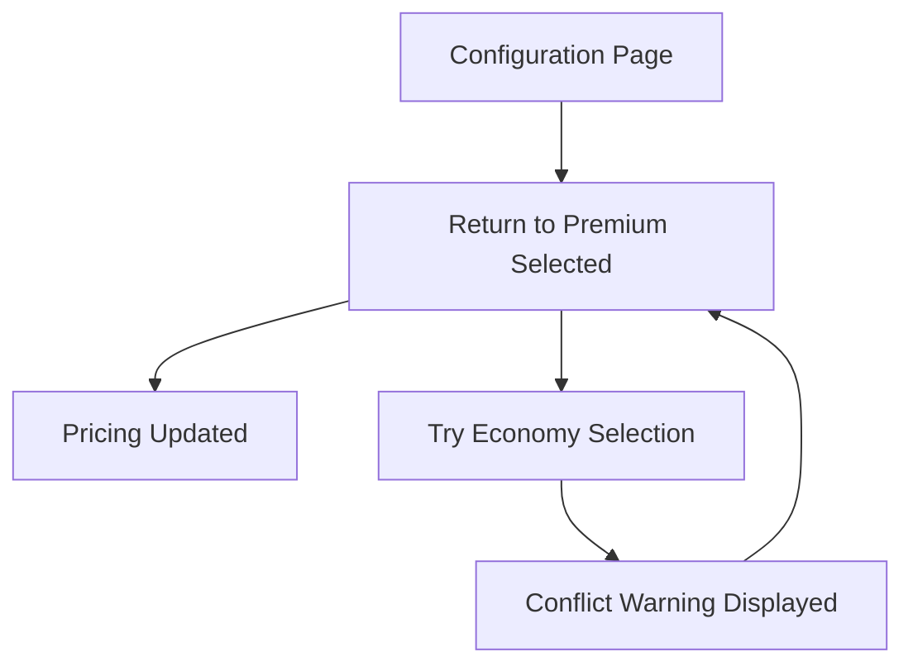

## 🐾 Series Navigation

- **Part 1: Why AI Starts Making Stuff Up**  
  *The cat has opinions — and your postcode formatting rules aren't one of them.*  
  [Read it →](link-to-part-1)

- **Part 2: Show, Don’t Tell: Teaching AI with Better Examples**  
  *Bribing the cat with gold standards and smaller piles of paper.*  
  *[Read it →](link-to-part-3)*

- **Part 3: How I Made My AI Stop Guessing**  
  *Teaching the cat one trick at a time with task-focused training.*  
  **(you are here)**

- **Part 4: The More You Say, the Less It Learns**  
  *When you talk too much, the cat stops listening — and invents new requirements instead.*  
  *(Coming soon)*


# The Subtle Art of Herding Cats: How I Turned Chaos Into a Repeatable Test Process (Part 3 of 4)

## Proof of Concept: Does This Actually Work?

In Part 2, I discovered that gold standards work better than rulebooks and lazy loading prevents Context Rot. Part 3 proves it works in practice - with real BMW vs Mercedes examples and an honest assessment of what actually happens when the cats meet reality.

## The Universal BDD Vision: BMW vs Mercedes Principle

### The Core Philosophy

My main belief about good BDD became clear through months of fighting domain contamination: **If two companies do the same thing - like BMW and Mercedes-Benz building car configurators - you should be able to lift a requirement from either company and produce the same BDD scenario.**

The scenario shouldn't contain:
- **Implementation details**: REST APIs, microservices, specific databases
- **System names**: ConfiguratorService v2.1, PricingEngine, ValidationAPI  
- **Technical artefacts**: JSON responses, event handlers, component states

Instead, it should focus on:
- **User intent**: What does the person want to accomplish?
- **User actions**: What do they actually do?
- **Observable results**: What do they see happen?

**The code behind is different, but the human need is identical.**

### The Problem: Implementation-Contaminated Scenarios

Here's what BDD scenarios look like when they're contaminated with implementation details:

```gherkin
# BMW's contaminated approach
Feature: BMW iDrive ConfiguratorService Integration [SPEC-BMW-123]
Background:
  Given the BMW ConnectedDrive API is initialized
  And the user authenticates via BMW ID OAuth
  And the PricingEngine microservice is available

Scenario: M Sport Package selection triggers pricing recalculation
  Given I have loaded the 3-series configurator via iDrive interface
  When I POST to /api/bmw/packages/m-sport with authentication headers
  Then the PricingCalculatorService should return updated totals
  And the frontend should display BMW-specific pricing components
  And the ConfiguratorState should persist to BMW backend systems

## 🐾 Series Navigation

- **Part 1: Why AI Starts Making Stuff Up**  
  *The cat has opinions — and your postcode formatting rules aren't one of them.*  
  [Read it →](link-to-part-1)

- **Part 2: Show, Don’t Tell: Teaching AI with Better Examples**  
  *Bribing the cat with gold standards and smaller piles of paper.*  
  *(← You are here)*

- **Part 3: How I Made My AI Stop Guessing**  
  *Teaching the cat one trick at a time with task-focused training.*  
  *(Coming soon)*

- **Part 4: The More You Say, the Less It Learns**  
  *When you talk too much, the cat stops listening — and invents new requirements instead.*  
  **Coming soon**


# Mercedes contaminated approach  
Feature: Mercedes MBUX Configurator Integration [SPEC-MB-456]
Background:
  Given the Mercedes me connect platform is active
  And MBUX infotainment system is responsive
  And the pricing validation service confirms availability

Scenario: AMG package selection updates Mercedes pricing display
  Given I access the C-Class configurator through MBUX interface
  When the system processes AMG package selection via Mercedes API
  Then the integrated pricing module recalculates total cost
  And Mercedes-specific UI components reflect package changes
  And the selection persists in Mercedes customer profile system
```

**The Problem**: These scenarios test implementation details, not user behavior. A tester would need completely different knowledge to understand BMW vs Mercedes scenarios, even though users do exactly the same thing.

> 📌 **Universal Behavior Insight**: Whether you're configuring a BMW 3-series or a Mercedes C-Class, users want to select packages, see pricing updates, and understand conflicts. The implementation varies wildly, but the user experience is basically identical.

### The Solution: Universal, Human-Focused Scenarios

Here's what the same functionality looks like when focused on universal human behavior:

```gherkin

# Works for BMW, Mercedes, Audi, or any car configurator
Feature: Vehicle Package Configuration [SPEC-123]

Scenario: Premium package selection updates pricing
  Given I am on the vehicle configuration page
  When I select the premium package
  Then I should see the updated total price
  And the premium package should be marked as selected

Scenario: Package conflict prevention  
  Given I have selected a premium package
  When I attempt to select a conflicting economy package
  Then I should see a conflict warning message
  And the economy package should remain unselected
  And my original premium selection should be preserved

Scenario: Package removal affects pricing  
  Given I have selected multiple packages
  When I remove the premium package
  Then the total price should decrease
  And the premium package should no longer appear selected
  And any dependent options should be automatically removed
```

### Domain Configuration Separation

Behind the scenes, each company uses their specific domain configuration:

**BMW Domain Config:**
```json
{
  "navigation_url": "https://bmw.com/configurator",
  "premium_package": "M Sport Package",
  "economy_package": "Efficiency Package",
  "api_endpoint": "BMW ConnectedDrive API",
  "pricing_currency": "EUR"
}
```

**Mercedes Domain Config:**
```json
{
  "navigation_url": "https://mercedes-benz.com/configurator", 
  "premium_package": "AMG Line Package",
  "economy_package": "Eco Package",
  "api_endpoint": "Mercedes me connect API",
  "pricing_currency": "EUR"
}
```

**The same universal scenarios get different domain implementations**, but testers can understand both instantly because they focus on universal human behavior, not technical complexity.

## The Complete Workflow: From Jira Ticket to Executable Tests

### Task 1: Context Extraction in Action

When a Jira ticket arrives, the AI agent (loaded only with analysis rules and domain context) creates a structured conversation log:

```markdown
## Requirements Analysis
- REQ-001: User can select vehicle packages
- REQ-002: Package selection updates total pricing  
- REQ-003: Conflicting packages show warning messages
- REQ-004: Package removal updates pricing and dependencies

## Positive Test Scenarios Identified
- Premium package selection with pricing update
- Multiple package selection and total calculation
- Package upgrade scenarios

## Negative Test Scenarios Identified  
- Conflicting package selection attempts
- Invalid package combinations
- Network error during selection

## Inferred Requirements (Agent Additions)
- Loading states during price calculation
- Confirmation for expensive package selections
- Package dependency validation
```

### Task 2: BDD Generation with Pattern-Led Prompting

The agent then loads BDD generation rules (and only those rules) plus the Task 1 output. Using the gold standards approach, it generates human-readable scenarios focused on business language and user actions.

The key insight: **The AI already knows BDD structure.** I didn't need to teach "Given-When-Then." I just needed to steer it toward business-focused language and user-observable outcomes.

### Task 3a: Behavioral Assessment - The Testing Filter

This is where the **Context Smartness** approach really shines. The agent loads only assessment criteria and applies strict behavioral filters:

**Include for Automation:**
- Multi-step user workflows
- Cross-component integration tests  
- Business process validation
- State persistence across actions

**Exclude from Automation:**
- Single component behavior (unit test territory)
- Subjective UX validation
- Accessibility testing (specialized tools needed)
- Performance without specific metrics

**Golden Rule**: Only test what you control. Don't put product prices or names in automation - they change. Test that prices display correctly and names appear consistently. Focus on the user's experience, not the system's internals - which apparently aligns with "intent-based testing" principles, though I just call it common sense.

### Task 3b: TAF Generation - From Human to Machine

The final task loads technical patterns and converts approved behavioral scenarios into executable automation code:

**Generated TAF Code:**
```gherkin
Scenario: Premium package selection updates pricing
  Given I navigate to the package configuration page
  When I select the premium package option
  Then the pricing display should show updated costs
  And the premium package should appear selected
```

**Generated Infrastructure Report:**
```markdown
## Required Page Objects
- PackageConfigurationPage
  - premiumPackageOption (data-testid="premium-package")
  - pricingDisplay (data-testid="pricing-total")  
  - packageSelectionIndicator (data-testid="selected-indicator")

## Missing Step Definitions
- "I select the premium package option"
- "the premium package should appear selected"
```

**The agent gets you 80-90% of the way there, then humans add the final details.**

## The State Diagram Breakthrough

### The Problem: AI Doesn't Know Your Application States

The LLM only knows what it knows. If you ask it to write API requests from a spec snippet, it will try - but the result usually looks acceptable while being completely wrong. **It doesn't know the states of your application.**

### The Solution: Plain English State Description

I started describing application states and process flows in simple English, usually based on Figma designs where the actual state transitions are visible.

Then I asked the agent to create Mermaid state diagrams from the scenarios:



**These diagrams revealed missing state transitions** that weren't clear in Jira stories but were visible in Figma designs. The AI became better at identifying incomplete workflows and suggesting additional test scenarios.

## Honest Assessment: What Actually Works

### The Wins ✅

**Consistency**: Generated scenarios follow the same patterns every time. No more wondering why one tester writes "Given I navigate to" while another writes "Given the user accesses."

**Speed**: Minutes instead of hours for complex features. What used to take an afternoon of careful scenario writing now happens in the time it takes to make coffee.

**Creativity**: The agent finds edge cases humans miss. It regularly identifies state transitions, error conditions, and user journey variations that don't appear in original requirements. Turns out when you focus on user behavior instead of technical implementation, you naturally discover more realistic test scenarios - something that intent-based testing advocates have been saying all along.

**Documentation**: Creates the specifications that were missing. Often the generated BDD scenarios are clearer than the original Jira tickets, becoming the source of truth for what the feature actually does.

**Onboarding**: New team members understand features faster. Universal, behavior-focused scenarios are self-documenting in ways that implementation-specific tests aren't.

### The Ongoing Challenges ⚠️

**Domain Drift**: Rules pick up domain specifics over time. You have to actively monitor and clean generic patterns to prevent contamination from creeping back in.

**Edge Case Handling**: Still needs human review for unusual scenarios. The AI excels at common patterns but struggles with genuinely unique business logic.

**Context Maintenance**: Domain configurations need regular updates. As products evolve, the mappings between universal patterns and specific implementations require ongoing care.

### What It Doesn't Fix ❌

**Bad Requirements**: Garbage in, garbage out still applies. I added a rule for this after wondering what would happen - it wasn't great. I made it worse by giving it state diagrams with insufficient context.

**Process Problems**: Technical solutions don't fix workflow issues. If your requirements are unclear, arrive late, or change constantly, AI won't solve those basic communication problems.

**Human Communication**: Still need clear specs and acceptance criteria. The AI amplifies the quality of your inputs - it doesn't create clarity from chaos.

**Domain Expertise**: Agent can't replace understanding your business. It can apply patterns consistently, but someone still needs to know whether the business logic makes sense.

## The Practical Implementation Guide

### Create Your Gold Standards
1. Pick your best existing BDD scenarios
2. Clean them to perfection  
3. Document why they're good
4. Use these as training examples

### Build Task-Based Rules  
1. Extract minimal rules from gold standards
2. Create focused rule sets per task
3. Test with lazy loading approach
4. Measure consistency improvements

### Implement the Full Workflow
1. **Task 1**: Context extraction and analysis
2. **Task 2**: Human-readable BDD generation  
3. **Task 3a**: Behavioral assessment
4. **Task 3b**: Automation code generation

### Measure and Refine
1. Compare generated vs manual scenarios
2. Track consistency metrics
3. Identify remaining edge cases  
4. Refine rules based on actual usage

## What's Coming in Part 4

The framework works, the cats stay in formation, and the scenarios are consistent. But here's the kicker: **I accidentally solved fundamental AI problems that billion-dollar companies are struggling with.**

In Part 4, I'll reveal:
- **The Context Rot discovery**: How I identified performance degradation months before it was documented
- **The billion-dollar irony**: Why VS Code + LLM gets funding while systematic AI reliability patterns go unnoticed  
- **Market implications**: How these principles could transform any AI-powered development tool
- **The accidental innovation**: From annoyed tester to AI reliability pioneer

The real breakthrough wasn't just herding cats - it was discovering principles that apply to any AI system trying to get consistent behavior from large language models.

---

*Paul Coles is a software tester who proved that universal BDD patterns work across domains when separated from implementation details. In Part 3, he demonstrates the complete framework in action with real examples and honest assessment of what works and what doesn't. His cat now stays mostly in the designated areas.*
