 The Subtle Art of Herding Cats: Context Rot and the Billion Dollar Opportunity (Part 4 of 4)

In Part 3, I proved the framework works with real BMW vs Mercedes examples. Part 4 reveals the bombshell: I accidentally solved "Context Rot" months before researchers named it, and my cat herding discoveries could be worth billions to AI companies who actually understand them.

## The Accidental Discovery That Changes Everything

Here's what keeps me up at night*: I got fed up with a waterfall team and their massive specs, so I built a solution. Along the way, I accidentally solved fundamental AI problems that venture capital-funded companies are now worth billions trying to commercialize.

*It doesn't.

The timeline is crucial to understanding the significance:
- **April 2024**: I'm fighting context overload and mysterious AI behavior
- **May-June 2024**: I develop lazy loading and focused context solutions
- **July 2024**: Research papers emerge documenting "Context Rot" - the exact phenomenon I'd been battling

**I solved Context Rot months before learning it had a name.**

## The Accidental Innovation: What I Actually Discovered

While trying to get consistent BDD scenarios, I unknowingly invented several AI reliability patterns:

### Context Engineering
**The art of providing exactly the right information at the right time.** Not comprehensive context - focused context. Not more information - better information. This became the foundation of my task-based architecture.

### Context Rot Detection  
**Identifying that LLMs work better with less context** - something I discovered through pure frustration when my "smart" agent got dumber as I added more rules. The 25% context window usage was literally degrading performance.

### Task-Based LLM Architecture
**Breaking complex AI workflows into focused, sequential tasks** where each task gets only the context it needs. No competing priorities, no overwhelming rule sets, no context contamination between tasks.

### Repeatable, Reliable AI Output
**Consistent results from inherently inconsistent systems** through gold standards, pseudocode rules, and systematic context management. The Holy Grail of AI automation.

Meanwhile, companies are earning billions by forking VS Code, adding an LLM, and calling it revolutionary AI-powered development.

## Context Rot: The Hidden AI Performance Killer

### What Context Rot Actually Is

**Context Rot** is a documented phenomenon where increasing input tokens actually degrades LLM performance. It's not just about fitting within context windows - it's about optimal performance zones.

Think of it like trying to have a conversation at a party:
- **Small group (low context)**: Clear, focused discussion
- **Medium group (optimal context)**: Rich, detailed conversation  
- **Crowded room (context rot zone)**: Everyone talks, nobody hears, confusion reigns

### My Accidental Discovery Timeline

**April**: My AI agent starts making inexplicable mistakes despite having "all the information it needs"
- Lowercasing postcodes mysteriously
- Ignoring mandatory rules
- Treating requirements as optional guidelines
- Performance degrading as I added more helpful context

**May**: I discover that 25% context window usage correlates with worse performance, not better
- Fewer rules = better adherence  
- Focused examples > comprehensive documentation
- Task separation eliminates competing instructions

**June**: I develop the lazy loading architecture that prevents context bloat
- Each task gets <5% context window
- Performance becomes predictable and reliable
- Consistent output finally achieved

**July**: Academic papers publish documenting "Context Rot" as a measurable LLM limitation

> 📌 **The Billion Dollar Insight**: I didn't set out to solve Context Rot - I just needed my BDD generator to work reliably. The broader applications only became obvious later.

## The Market Irony: What Gets Funded vs What Actually Matters

### What Gets Venture Capital 💰💰💰
- **"We put AI in your code editor!"**
- **"Chat with your codebase!"** 
- **"AI pair programming!"**
- **"Intelligent code completion!"**

### What I Actually Solved
- **Performance degradation from excessive context** (Context Rot mitigation)
- **Inconsistent LLM outputs** (Reliability patterns)
- **Domain contamination in rule sets** (Separation of concerns)
- **Task-focused AI workflow design** (Context optimization)

The irony is profound: my Context Rot mitigation principles could improve every single one of those billion-dollar AI coding tools. They're all struggling with the same fundamental problems:

- **How much context is too much before performance degrades?**
- **How do you prevent Context Rot in long conversations?**  
- **How do you maintain consistency without overwhelming the LLM with competing instructions?**

Only recently did I discover that what I'd been calling "context overload" has a name: **Context Rot** - a documented phenomenon where increasing input tokens actually makes LLMs perform worse.

## The Framework's Broader Applications

### Beyond BDD: Universal AI Reliability Principles

What I built wasn't just a BDD generator - it was a framework for reliable AI behavior that accidentally solved problems I didn't know existed:

**1. Context Smartness Over Context Comprehensiveness**
Focused context beats comprehensive context every time. This applies to any AI system - coding assistants, documentation generators, analysis tools.

**2. Lazy Loading Architecture** 
Only load what you need, when you need it. Prevents context bloat and maintains performance across long interactions.

**3. Gold Standard Training**
Examples teach better than rules. This principle could revolutionize how we train AI systems across domains.

**4. Task-Based Workflow Design**
Sequential, focused AI operations with minimal context overhead. Each task masters one thing instead of knowing a little about everything.

**5. Pattern-Led Prompting**
Show the AI perfect examples and let it extract principles, rather than trying to document every edge case.

### Current Market Problems These Solve

Every AI-powered development tool faces these challenges:

**Context Management**: How do you provide relevant information without overwhelming the AI?
**Consistency**: How do you get the same quality output across different sessions and users?  
**Reliability**: How do you prevent AI systems from degrading over time as context accumulates?
**Scalability**: How do you maintain performance as complexity increases?

My accidental discoveries provide systematic approaches to all of these problems.

## Innovation vs Market Timing: The Lesson

### The Pattern of Accidental Innovation

The best innovations often come from solving your own specific problems rather than chasing obvious market opportunities:

- **I needed**: Consistent BDD scenarios from annoying waterfall specs
- **I built**: Task-focused AI architecture with context optimization
- **I discovered**: Fundamental principles applicable to any AI system
- **The market realizes**: These patterns solve billion-dollar problems

### The Subtle Art vs The Obvious Solution

Companies making bank right now are tackling obvious problems with obvious approaches:
- Code editor + AI = funded
- Chat interface + codebase = funded  
- Autocomplete + machine learning = funded

The subtle innovations - Context Rot mitigation, systematic reliability patterns, task-based AI architectures - come from people who just want their specific tool to work predictably.

**The market rewards the obvious while missing the foundational.**

## The Future of AI Workflow Design

### What's Coming Next

Based on my framework's success and the broader context optimization principles:

**Self-Improving Context Management**: AI systems that automatically optimize their own context usage based on performance metrics

**Multi-Domain Configuration**: The same core patterns applied across different problem domains - testing, documentation, analysis, code generation

**Real-Time Quality Metrics**: Systems that monitor Context Rot in real-time and adjust context loading accordingly

**Collaborative AI Architectures**: Multiple focused AI agents working together rather than one agent trying to do everything

### The Ultimate Goal

**Requirements go in, consistent results come out.** Humans focus on high-value creative work - defining what needs to be done, evaluating results, handling edge cases that require domain expertise.

The cats herd themselves, but humans still decide where the herd should go.

## The Competitive Advantage Hidden in Plain Sight

### Why This Matters for AI Development Tools

Every company building AI-powered development tools will eventually hit the Context Rot wall:
- Users want more features → More context needed → Performance degrades
- Long conversations accumulate context → Token limits approached → Quality drops  
- Complex projects require comprehensive context → Context Rot kicks in → Reliability suffers

**The companies that understand context optimization will win.** Not because they have better AI models, but because they know how to use them effectively.

### The Framework's Market Applications

The principles I discovered for BDD generation apply to any AI-powered tool:

**Code Generation**: Task-focused context loading for different types of code work
**Documentation**: Lazy loading of relevant context based on documentation type
**Analysis Tools**: Focused AI attention on specific analysis tasks
**Design Systems**: Pattern-led prompting for consistent design outcomes

## The Subtle Art Mastered: Final Lessons

### What I Learned About AI and Humans

Training an AI agent for BDD generation taught me that the subtle art isn't in the technology - it's in understanding how to work with AI as a creative partner rather than trying to make it think like a human.

**The cats can be herded, but they need:**
- **Clear direction** (gold standards that show the destination)
- **Focused attention** (lazy loading that prevents overwhelm)  
- **Reasonable expectations** (80-90% accuracy with human refinement)
- **Human oversight** (review, refinement, and strategic direction)

### The Psychology of AI Systems

After months of training and refinement, I've learned that the best AI agents are like well-trained cats.

------

# The Subtle Art of Herding Cats: Visual Summary Assets

## 1. Task-Based Architecture Diagram

```mermaid
graph TD
    A[Jira Ticket Input] --> B[Base Context Always Loaded]
    B --> C{Task Router}
    
    C --> D[Task 1: Context Extraction]
    C --> E[Task 2: BDD Generation] 
    C --> F[Task 3a: Behavioral Assessment]
    C --> G[Task 3b: TAF Generation]
    
    D --> D1[Analysis Rules<br/>+ Domain Context<br/>❌ BDD Patterns<br/>❌ Automation Rules]
    E --> E1[BDD Patterns<br/>+ Task 1 Output<br/>❌ Assessment Rules<br/>❌ Technical Details]
    F --> F1[Assessment Criteria<br/>+ Task 2 Output<br/>❌ Code Generation<br/>❌ Implementation]
    G --> G1[Technical Patterns<br/>+ Approved Scenarios<br/>❌ Analysis Rules<br/>❌ BDD Guidelines]
    
    D1 --> H[Conversation Log]
    E1 --> I[Human-Readable BDD]
    F1 --> J[Assessment Report]
    G1 --> K[Executable Tests]
    
    style B fill:#e1f5fe
    style D fill:#f3e5f5
    style E fill:#e8f5e8
    style F fill:#fff3e0
    style G fill:#fce4ec
    
    classDef contextBox fill:#fff,stroke:#333,stroke-width:2px
    class D1,E1,F1,G1 contextBox
```



**Key Insight**: Each task gets <5% context vs 25% for everything at once. Context Smartness = Right info, right time, right amount.

---

## 2. Bad vs Good BDD Comparison Table

| Aspect | ❌ Bad (Implementation-Contaminated) | ✅ Good (Universal Human Behavior) |
|--------|-------------------------------------|-----------------------------------|
| **Focus** | Technical systems and APIs | User actions and observable results |
| **Language** | `POST to /api/bmw/packages/m-sport` | `When I select the premium package` |
| **Scope** | Company-specific implementations | Universal human needs |
| **Maintenance** | Breaks when systems change | Stable across implementations |
| **Reusability** | BMW-only, Mercedes needs rewrite | Works for any car configurator |
| **Tester Knowledge** | Must understand BMW vs Mercedes APIs | Understands user behavior patterns |
| **Business Value** | Tests technical integration | Tests customer experience |
| **Example** | `Given BMW ConnectedDrive API initialized` | `Given I am on the configuration page` |

**The BMW vs Mercedes Principle**: Same human need = Same BDD scenario, regardless of the technical implementation behind it.

---

## 3. The Cat Rule Cheat Sheet

### 🐱 The 10 Commandments of AI Cat Herding

1. **The Cat Rule**: Never give AI more than 10 competing instructions
2. **Context Smartness**: Right info, right time, right amount (not everything at once)
3. **Show, Don't Tell**: Perfect examples beat comprehensive rulebooks
4. **Guidelines vs Rules**: Use pseudocode for mandatory processes, natural language for style
5. **Lazy Loading**: Each task gets only the context it needs
6. **Domain Separation**: Universal patterns + domain config = reusable scenarios
7. **Embrace AI Creativity**: Let AI suggest "made up" requirements in separate sections
8. **Gold Standards**: One perfect example teaches better than 300 lines of documentation
9. **Pattern-Led Prompting**: Let AI extract principles from examples
10. **80-90% Rule**: Don't let perfect be the enemy of good

### 🎯 Quick Implementation Checklist
- [ ] Create your gold standard BDD scenario
- [ ] Extract 5-10 key principles (not 47 rules)
- [ ] Separate domain-specific values into config files
- [ ] Use pseudocode for critical logic: `IF/THEN/ELSE`
- [ ] Load focused context per task, not everything
- [ ] Measure consistency improvements vs manual creation

---

## 4. Context Rot Infographic

### 📊 Context Rot: The Hidden AI Performance Killer

```
🎯 OPTIMAL PERFORMANCE ZONE
┌─────────────────────────────┐
│  Context Usage: <10%        │
│  Performance: Excellent ✅   │
│  Consistency: High ✅        │  
│  Response Quality: Focused  │
└─────────────────────────────┘

⚠️  PERFORMANCE DEGRADATION ZONE  
┌─────────────────────────────┐
│  Context Usage: 10-20%      │
│  Performance: Good ⚠️        │
│  Consistency: Variable ⚠️    │
│  Response Quality: Scattered │
└─────────────────────────────┘

❌ CONTEXT ROT ZONE
┌─────────────────────────────┐
│  Context Usage: >25%        │
│  Performance: Poor ❌        │
│  Consistency: Unreliable ❌  │
│  Response Quality: Confused │
└─────────────────────────────┘
```

### 📈 The Discovery Timeline
- **April 2024**: Fighting mysterious AI failures at 25% context usage
- **May 2024**: Discover fewer rules = better performance  
- **June 2024**: Develop lazy loading architecture (<5% per task)
- **July 2024**: Research papers document "Context Rot" phenomenon

### 💡 The Solution: Task-Based Context Loading
Instead of loading everything:
```
❌ Old Way: All 47 rules + domain + examples = 25% context = Poor performance

✅ New Way: 
   Task 1: Analysis rules only = <5% context = Excellent performance
   Task 2: BDD patterns only = <5% context = Excellent performance  
   Task 3: Assessment rules only = <5% context = Excellent performance
```

### 🎯 Key Insight
**More context ≠ Better results**
Context Rot proves that AI performance degrades with excessive input tokens. The secret is Context Smartness: focused information delivery.

---

## 5. One-Page Executive Summary

### The Subtle Art of Herding Cats: Executive Overview

**The Problem**: AI agents ignore rules, produce inconsistent output, and get worse as you give them more information.

**The Discovery**: Through training an AI for BDD test generation, accidentally solved "Context Rot" - a documented AI performance degradation phenomenon.

**The Solution Framework**:
- **Gold Standards**: Show perfect examples instead of writing comprehensive rules
- **Lazy Loading**: Each task gets focused context, not everything at once  
- **Pattern-Led Prompting**: Let AI extract principles from examples
- **Domain Separation**: Universal patterns + specific configurations = reusable tools

**Real Results**:
- ✅ 80-90% automation of BDD scenario generation
- ✅ Consistent output across team members
- ✅ Minutes instead of hours for complex features
- ✅ Universal patterns work across different domains

**Market Implications**: 
These context optimization principles could improve any AI-powered development tool. Companies making billions with "AI + code editor" are struggling with the same Context Rot problems this framework solves.

**The Billion Dollar Insight**: 
Accidentally solved fundamental AI reliability challenges months before academic research documented them. Context Smartness beats context comprehensiveness every time.