# The Subtle Art of Herding Cats: Why AI Agents Ignore Your Rules (Part 1 of 4)

## TL;DR for Busy Cat Herders

In 30 seconds: I spent months training an AI to create BDD tests. I discovered that LLMs are like keen cats - they forget instructions when given too many commands. This is Part 1 of my journey from chaos to **Context Smartness**. Parts 2-4 cover the solutions, framework, and market implications.

## Who This Is For

**Primary Audience**: Test automation engineers building AI workflows who need consistent, reliable output from unpredictable AI systems.

**Also valuable for**: Test leads justifying AI investment, AI workflow engineers in any domain, and anyone discovering that "smart" AI agents have the attention span of caffeinated kittens.

Different readers will benefit differently:
- **Practitioners**: Learn specific patterns for AI training
- **Leads**: Understand why AI initiatives fail and what works
- **Engineers**: See systematic approaches to AI reliability

## The Dream vs. Reality: When Smart Cats Act Dumb

I started this journey with a simple dream: get AI to read specs for me. I hadn't worked with multi-page specs for years. How hard could it be? The agent would understand context, follow rules, and produce perfect scenarios every time.

Reality check: AI agents are like cats. They're very clever, but they have their own views on which rules count. They will ignore you when it suits them.

## The Training Chronicles: From Optimism to Enlightenment

### Phase 1: It's AI right, it's clever!

I began treating the LLM like an equal - a brilliant colleague who needed proper instruction. I worked with them. I made clear rules, shared important context, and expected steady results.

The conversations went like this:
- **Me**: "Here are 47 detailed rules for writing BDD scenarios"
- **Agent**: "Got it! I understand perfectly"
- **Agent**: *Proceeds to lowercase postcodes for mysterious reasons*
- **Me**: "Why did you do that? There's nothing in the domain file about lowercase postcodes"
- **Agent**: "There are too many rules. I can't follow everything."

It was like chatting with a polite cat. It nods along, but then it still knocks your coffee mug off the table.

> 📌 **The Cat Rule Discovered**: AI agents, like cats, can't follow more than 10 competing instructions effectively. Beyond that threshold, performance degrades measurably.

### The More You Say, the Less It Hears

As I refined the rules over time, they grew and grew. I was using 25% of Amazon Q's available context window after some time. The agent was drowning in information:

```markdown
Rules included:
✓ Generic BDD patterns         ✓ Domain-specific mappings
✓ Assessment criteria          ✓ Implementation details
✓ Quality gates               ✓ Error handling
✓ Naming conventions          ✓ Edge case handling
✓ Reporting structures        ✓ ... and 38 more categories
```

The problem became clear: **The agent forgets things when the context is too large.**

LLMs have extensive knowledge, but their application lacks consistency when overwhelmed. It's like asking a cat to follow 47 commands at once. They ignore most, and the noise makes them mess up the few they do hear.

> 📌 **Context Rot Identified**: Increasing input tokens actually degrades LLM performance - a phenomenon I discovered months before learning it had a name.

### Why Your AI Starts Making Stuff Up

The breaking point came when I attempted to ensure the agent used domain context with precision. It kept making odd choices:
- Lowercase postcodes (nowhere in the rules)
- Technical error messages in human-readable scenarios
- Treating mandatory rules as optional guidelines

But the real problem wasn't just domain contamination. I had unknowingly created a perfect storm of conflicting information and massive context load that was literally making the AI dumber.

The conversations about 'why' things happened had contaminated the "generic" BDD patterns with car configurator specifics, package bundle terminology, and React SPA assumptions. But worse, the huge amount of context was hurting performance in ways I didn't understand then.

**The tool was becoming domain-specific instead of universally applicable, AND performing worse as context expanded.**

## It's More of a Guideline

Then it struck me - the lightbulb turned on. **I was treating the LLM as an equal, but it isn't.** It's not as smart as I thought in the way I thought (my internal monologue was less charitable).

The agent needed different training than a human colleague would. Even with focused context loading, the AI perceived key requirements as optional unless the language was clearly commanding. Or not applying mandatory rules - they were more guidelines.

> 📌 **Pattern-Led Prompting Principle**: AI agents respond better to examples than explanations, and pseudocode better than natural language for complex logic.

This discovery would lead to what I now call **Context Smartness** - providing exactly the right information, at the right time, in the right amount.

## Key Discoveries from Part 1

Through months of frustrating talks with my AI agent, I found several basic principles:

### The Cat Rule
Never give AI more than 10 competing instructions. Beyond this point, performance drops as the agent struggles to work out what matters most.

### Context Rot
Adding more input tokens actually makes LLMs perform worse - not better. I was using 25% of Amazon Q's context window and wondering why my "smart" agent was getting dumber.

### Domain Contamination
Generic rules slowly pick up domain-specific details through repeated conversations. This makes tools less reusable and adds to context bloat.

### The Guidelines vs Rules Problem
AI agents treat everything as flexible unless you use very clear commanding language. "Please assess carefully" becomes optional; "MANDATORY: ASSESS(scenario, gates=[0,1,2,3])" gets followed.

## What's Coming Next

In the remaining parts of this series, I'll show you exactly how I solved these problems:

- **Part 2**: "Show, Don’t Tell: Teaching AI by Example" - The breakthrough solutions that actually worked
- **Part 3**: "How I Turned Chaos Into a Repeatable Test Process" - Real examples with BMW vs Mercedes
- **Part 4**: "Context Rot and the Billion Dollar Opportunity" - Why these solutions matter for the AI industry

Each problem in Part 1 has a matching solution. The cat can be herded, but not the way you think.

## The Foundation for What's Next

The problems I discovered - Context Rot, domain contamination, the guidelines vs rules confusion - aren't just BDD testing issues. They're fundamental AI reliability challenges that affect any system trying to get consistent behaviour from large language models.

In Part 2, I'll show you the **Context Smartness** approach that solved all of these problems: focused examples instead of comprehensive rules, task-based lazy loading, and the magic of "show, don't tell."

The cats stayed in formation, but it took understanding their psychology first.

---

*Paul Coles is a software tester who accidentally discovered several AI reliability patterns while trying to automate BDD scenario generation. In this 4-part series, he shares the systematic approach that transformed unpredictable AI behaviour into reliable, consistent output. His actual cat still ignores most commands.*

## 🐾 Series Navigation

- **Part 1: Why AI Starts Making Stuff Up**  
  *The cat has opinions — and your postcode formatting rules aren't one of them.*  
  **(you are here)**

- **Part 2: Show, Don’t Tell: Teaching AI with Better Examples**  
  *Bribing the cat with gold standards and smaller piles of paper.*  
  *(Coming soon)*

- **Part 3: How I Made My AI Stop Guessing**  
  *Teaching the cat one trick at a time with task-focused training.*  
  *(Coming soon)*

- **Part 4: The More You Say, the Less It Learns**  
  *When you talk too much, the cat stops listening — and invents new requirements instead.*  
  *(Coming soon)*


# The Subtle Art of Herding Cats: Show, Don’t Tell: Teaching AI by Example (Part 2 of 4)

## Quick Recap: The Problems We Discovered

In Part 1, I learned the hard way that giving AI 47 rules is like trying to get a cat to do well, much of anything. In Part 2, I'll show you the approach that finally made it behave: gold standards and lazy loading.

## Show, Don't Tell

### The Failed Approach: Death by Documentation

My first idea was to write complete rules. 300 lines of detailed instructions covering every possible scenario, edge case, and formatting requirement. The AI nodded politely and ignored most of it.

The talks were exhausting:
- **Me**: "Why didn't you follow the naming rules?"
- **Agent**: "Which ones? There were several different patterns mentioned."
- **Me**: "The ones in section 4.2.1 about specification references!"
- **Agent**: "I focused on the examples in section 6.3 instead."

Sound familiar? I was trying to teach by explanation rather than showing examples.

### The Breakthrough Moment

Instead of writing more rules, I tried something different. I created one perfect example of what I wanted:

**Gold Standard BDD Scenario:**
```gherkin
Feature: Product Configuration [SPEC-123]

Scenario: Premium package selection shows correct pricing
  Given I am on the product configuration page
  When I select the premium package
  Then I should see the premium pricing displayed
  And the package should be marked as selected
```

Then I asked the agent: **"Look at this gold standard. What rules do you need to reproduce this quality?"**

The magic happened. Instead of 300 lines of rules, the AI found 10 key principles:
- Use clear, business-focused language
- Follow Given-When-Then structure  
- Include specification references
- Focus on user-observable outcomes

> 📌 **Pattern-Led Prompting Discovery**: AI agents learn better from perfect examples than from detailed explanations. Show the destination, let them find the path.

### The Domain Separation Breakthrough  

The gold standard looked simple, but there was hidden cleverness. Some elements needed to come from domain configuration, not be hardcoded in the pattern:

**Universal Pattern:**
```gherkin
Feature: Vehicle Package Configuration [SPEC-123]

Scenario: Premium package selection shows correct pricing
  Given I am on the [DOMAIN: configuration_page_url]
  When I select the [DOMAIN: premium_package_name]  
  Then I should see the [DOMAIN: pricing_display_format] updated
  And the package should show [DOMAIN: selection_indicator_state]
```

**Domain Configuration:**
```json
{
  "configuration_page_url": "vehicle configuration page",
  "premium_package_name": "M Sport Package",
  "pricing_display_format": "total pricing", 
  "selection_indicator_state": "as selected"
}
```

For an online sock store, the same pattern works with different domain values:
- Product categories: "athletic socks"
- Size options: "Size 8-10"  
- Error messages: "Sorry, out of stock in your size"
- UI elements: "add to basket button"

**The pattern stays universal, but the domain makes it real.**

### "Show, Don't Tell" in Practice

This discovery matched a principle I'd written in my framework: **"Show, don't tell."** Instead of explaining what makes good BDD, I showed the agent perfect examples and let it find the patterns.

But I learned there's a big difference between **guidelines** (flexible suggestions) and **rules** (mandatory requirements). For things that absolutely had to happen, I needed very clear language.

## Lazy Loading Context: The Architecture That Changed Everything

### The Problem: Context Explosion

Using 25% of Amazon Q's context window was like trying to have a talk in a library during a fire drill. Too much information, too much noise, too many competing priorities.

The AI was drowning in:
```markdown
✓ Generic BDD patterns         ✓ Domain-specific mappings
✓ Assessment criteria          ✓ Implementation details  
✓ Quality gates               ✓ Error handling
✓ Naming conventions          ✓ Edge case handling
✓ Reporting structures        ✓ 38 more categories...
```

### The Solution: Task-Based Context Loading

I realized the agent needed **focused context per task**, not everything at once. Here's the architecture that worked:

#### Base Context (Always Available)
- Task execution framework
- Conversation logging patterns
- State management rules

#### Dynamic Context (Loaded Per Task)

**Task 1: Context Extraction**
- **Load**: Analysis rules + Domain context only
- **Goal**: Extract requirements from Jira  
- **Output**: Structured conversation log
- **Blocked**: BDD patterns, automation rules, technical details

**Task 2: BDD Generation**
- **Load**: BDD patterns + Task 1 output only
- **Goal**: Create human-readable scenarios
- **Output**: Feature files for manual testing
- **Blocked**: Automation assessment, technical implementation

**Task 3a: Behavioural Assessment** 
- **Load**: Assessment criteria + Task 2 output only
- **Goal**: Determine automation suitability
- **Output**: Automation assessment report
- **Blocked**: Code generation patterns, implementation details

**Task 3b: TAF Generation**
- **Load**: Technical patterns + approved scenarios only
- **Goal**: Create executable automation code  
- **Output**: TAF-compatible feature files
- **Blocked**: Analysis rules, BDD guidelines

> 📌 **Context Smartness Principle**: Each task gets exactly the context it needs - no more, no less. No competing priorities, no overwhelming rule sets.

### The Performance Impact

The difference was dramatic:
- **Before**: 25% context usage, inconsistent results, mysterious failures
- **After**: <5% context per task, reliable patterns, predictable behavior

The AI went from confused and unreliable to focused and consistent. Each task could concentrate on its specific job without distraction.

## Pseudocode Rules: When You Absolutely Must Be Obeyed

### The Guidelines vs Rules Problem

Even with focused context, the AI would still treat critical requirements as optional suggestions. Natural language left too much room for creative interpretation.

**Before (Ignored):**
"Please assess each scenario carefully, considering automation suitability and technical feasibility."

**After (Followed Religiously):**
```pseudocode
FOR EACH scenario IN bdd_scenarios:
    IF scenario.type == "accessibility":
        EXCLUDE(scenario, reason="specialized_tools_required")
    ELIF scenario.complexity == "single_component": 
        EXCLUDE(scenario, reason="unit_test_territory")
    ELSE:
        ASSESS(scenario, gates=[0,1,2,3])
```

### Mandatory Language That Works

For absolutely critical processes, I learned to use clear commanding language:
- **'MANDATORY'** - not "should" or "please"
- **'ZERO TOLERANCE'** - not "try to avoid" 
- **'AUTOMATIC EXCLUSIONS'** - not "generally not recommended"

The AI follows pseudocode and explicit commands while treating natural language as flexible guidance.

## The "Made Up" Requirements Solution: Embracing AI Creativity

### The Unexpected Discovery

Here's something that surprised me: the agent kept adding requirements that weren't in the original spec. My first idea was to stop this behavior.

Instead, I asked it to **share invented requirements in a separate section.**

### The Conversation State Pattern

The breakthrough was having the agent create a structured conversation log in Task 1:

```markdown
## Requirements Analysis
- REQ-001: User can select premium packages
- REQ-002: Pricing updates when packages change  
- REQ-003: Conflicts prevent invalid combinations

## Positive Test Scenarios
- Premium package selection
- Price calculation accuracy
- Package combination validation

## Negative Test Scenarios  
- Invalid package combinations
- Error handling for unavailable options

## Inferred Requirements (Agent Additions)
- Loading states during price calculation
- Confirmation dialogs for expensive options
- Network error handling
```

### The Value of AI Inference

Sometimes these "made up" requirements were brilliant:
- "What happens during price calculation loading?"
- "Should there be confirmation for expensive options?"  
- "How do we handle network errors?"

The agent was thinking like a tester, finding gaps in specifications. I learned to embrace this creativity rather than suppress it - but keep it clearly labeled so humans could check the suggestions.

## Quick Wins You Can Implement Today

### 1. Create Your Gold Standard (15 minutes)
Find your best existing BDD scenario and clean it to perfection. This becomes your teaching example.

### 2. Extract Minimal Rules (10 minutes)  
Ask your AI: "What rules do you need to reproduce this quality?" You'll get 5-10 essential principles instead of 300 lines of documentation.

### 3. Separate Domain from Pattern (20 minutes)
Identify what's universal (user actions, observable results) vs domain-specific (product names, URLs, error messages). Put domain details in separate configuration.

### 4. Use Pseudocode for Critical Logic (10 minutes)
Replace "Please assess carefully" with explicit IF/THEN logic for anything that must happen without exception.

## What's Coming in Part 3

These solutions sound good in theory, but do they actually work in practice? In Part 3, I'll show you:

- **Real before/after examples**: BMW vs Mercedes contaminated scenarios transformed into universal patterns
- **The framework in action**: Complete workflow from Jira ticket to executable tests  
- **Honest assessment**: What actually works, ongoing challenges, and what it doesn't fix
- **What Not to Automate: Smarter Test Filtering**: How to decide what should be automated vs tested manually

The cats are starting to line up, but the real test is whether they stay in formation when facing real-world complexity.

---

*Paul Coles is a software tester who discovered that AI agents respond better to examples than explanations. In Part 2, he reveals the specific techniques that transformed chaotic AI behavior into reliable, consistent output. His actual cat learned to use the litter tray but still ignores most other commands.*

## 🐾 Series Navigation

- **Part 1: Why AI Starts Making Stuff Up**  
  *The cat has opinions — and your postcode formatting rules aren't one of them.*  
  [Read it →](link-to-part-1)

- **Part 2: Show, Don’t Tell: Teaching AI with Better Examples**  
  *Bribing the cat with gold standards and smaller piles of paper.*  
  **← You are here**

- **Part 3: How I Made My AI Stop Guessing**  
  *Teaching the cat one trick at a time with task-focused training.*  
  *(Coming soon)*

- **Part 4: The More You Say, the Less It Learns**  
  *When you talk too much, the cat stops listening — and invents new requirements instead.*  
  *(Coming soon)*


# The Subtle Art of Herding Cats: How I Turned Chaos Into a Repeatable Test Process (Part 3 of 4)

## Proof of Concept: Does This Actually Work?

In Part 2, I discovered that gold standards work better than rulebooks and lazy loading prevents Context Rot. Part 3 proves it works in practice - with real BMW vs Mercedes examples and an honest assessment of what actually happens when the cats meet reality.

## The Universal BDD Vision: BMW vs Mercedes Principle

### The Core Philosophy

My main belief about good BDD became clear through months of fighting domain contamination: **If two companies do the same thing - like BMW and Mercedes-Benz building car configurators - you should be able to lift a requirement from either company and produce the same BDD scenario.**

The scenario shouldn't contain:
- **Implementation details**: REST APIs, microservices, specific databases
- **System names**: ConfiguratorService v2.1, PricingEngine, ValidationAPI  
- **Technical artefacts**: JSON responses, event handlers, component states

Instead, it should focus on:
- **User intent**: What does the person want to accomplish?
- **User actions**: What do they actually do?
- **Observable results**: What do they see happen?

**The code behind is different, but the human need is identical.**

### The Problem: Implementation-Contaminated Scenarios

Here's what BDD scenarios look like when they're contaminated with implementation details:

```gherkin

## 🐾 Series Navigation

- **Part 1: Why AI Starts Making Stuff Up**  
  *The cat has opinions — and your postcode formatting rules aren't one of them.*  
  [Read it →](link-to-part-1)

- **Part 2: Show, Don’t Tell: Teaching AI with Better Examples**  
  *Bribing the cat with gold standards and smaller piles of paper.*  
  *(← You are here)*

- **Part 3: How I Made My AI Stop Guessing**  
  *Teaching the cat one trick at a time with task-focused training.*  
  **Coming soon**

- **Part 4: The More You Say, the Less It Learns**  
  *When you talk too much, the cat stops listening — and invents new requirements instead.*  
  *(Coming soon)*


# BMW's contaminated approach
Feature: BMW iDrive ConfiguratorService Integration [SPEC-BMW-123]
Background:
  Given the BMW ConnectedDrive API is initialized
  And the user authenticates via BMW ID OAuth
  And the PricingEngine microservice is available

Scenario: M Sport Package selection triggers pricing recalculation
  Given I have loaded the 3-series configurator via iDrive interface
  When I POST to /api/bmw/packages/m-sport with authentication headers
  Then the PricingCalculatorService should return updated totals
  And the frontend should display BMW-specific pricing components
  And the ConfiguratorState should persist to BMW backend systems

## 🐾 Series Navigation

- **Part 1: Why AI Starts Making Stuff Up**  
  *The cat has opinions — and your postcode formatting rules aren't one of them.*  
  [Read it →](link-to-part-1)

- **Part 2: Show, Don’t Tell: Teaching AI with Better Examples**  
  *Bribing the cat with gold standards and smaller piles of paper.*  
  *(← You are here)*

- **Part 3: How I Made My AI Stop Guessing**  
  *Teaching the cat one trick at a time with task-focused training.*  
  *(Coming soon)*

- **Part 4: The More You Say, the Less It Learns**  
  *When you talk too much, the cat stops listening — and invents new requirements instead.*  
  **Coming soon**


# Mercedes contaminated approach  
Feature: Mercedes MBUX Configurator Integration [SPEC-MB-456]
Background:
  Given the Mercedes me connect platform is active
  And MBUX infotainment system is responsive
  And the pricing validation service confirms availability

Scenario: AMG package selection updates Mercedes pricing display
  Given I access the C-Class configurator through MBUX interface
  When the system processes AMG package selection via Mercedes API
  Then the integrated pricing module recalculates total cost
  And Mercedes-specific UI components reflect package changes
  And the selection persists in Mercedes customer profile system
```

**The Problem**: These scenarios test implementation details, not user behavior. A tester would need completely different knowledge to understand BMW vs Mercedes scenarios, even though users do exactly the same thing.

> 📌 **Universal Behavior Insight**: Whether you're configuring a BMW 3-series or a Mercedes C-Class, users want to select packages, see pricing updates, and understand conflicts. The implementation varies wildly, but the user experience is basically identical.

### The Solution: Universal, Human-Focused Scenarios

Here's what the same functionality looks like when focused on universal human behavior:

```gherkin

# Works for BMW, Mercedes, Audi, or any car configurator
Feature: Vehicle Package Configuration [SPEC-123]

Scenario: Premium package selection updates pricing
  Given I am on the vehicle configuration page
  When I select the premium package
  Then I should see the updated total price
  And the premium package should be marked as selected

Scenario: Package conflict prevention  
  Given I have selected a premium package
  When I attempt to select a conflicting economy package
  Then I should see a conflict warning message
  And the economy package should remain unselected
  And my original premium selection should be preserved

Scenario: Package removal affects pricing  
  Given I have selected multiple packages
  When I remove the premium package
  Then the total price should decrease
  And the premium package should no longer appear selected
  And any dependent options should be automatically removed
```

### Domain Configuration Separation

Behind the scenes, each company uses their specific domain configuration:

**BMW Domain Config:**
```json
{
  "navigation_url": "https://bmw.com/configurator",
  "premium_package": "M Sport Package",
  "economy_package": "Efficiency Package",
  "api_endpoint": "BMW ConnectedDrive API",
  "pricing_currency": "EUR"
}
```

**Mercedes Domain Config:**
```json
{
  "navigation_url": "https://mercedes-benz.com/configurator", 
  "premium_package": "AMG Line Package",
  "economy_package": "Eco Package",
  "api_endpoint": "Mercedes me connect API",
  "pricing_currency": "EUR"
}
```

**The same universal scenarios get different domain implementations**, but testers can understand both instantly because they focus on universal human behavior, not technical complexity.

## The Complete Workflow: From Jira Ticket to Executable Tests

### Task 1: Context Extraction in Action

When a Jira ticket arrives, the AI agent (loaded only with analysis rules and domain context) creates a structured conversation log:

```markdown
## Requirements Analysis
- REQ-001: User can select vehicle packages
- REQ-002: Package selection updates total pricing  
- REQ-003: Conflicting packages show warning messages
- REQ-004: Package removal updates pricing and dependencies

## Positive Test Scenarios Identified
- Premium package selection with pricing update
- Multiple package selection and total calculation
- Package upgrade scenarios

## Negative Test Scenarios Identified  
- Conflicting package selection attempts
- Invalid package combinations
- Network error during selection

## Inferred Requirements (Agent Additions)
- Loading states during price calculation
- Confirmation for expensive package selections
- Package dependency validation
```

### Task 2: BDD Generation with Pattern-Led Prompting

The agent then loads BDD generation rules (and only those rules) plus the Task 1 output. Using the gold standards approach, it generates human-readable scenarios focused on business language and user actions.

The key insight: **The AI already knows BDD structure.** I didn't need to teach "Given-When-Then." I just needed to steer it toward business-focused language and user-observable outcomes.

### Task 3a: Behavioral Assessment - The Testing Filter

This is where the **Context Smartness** approach really shines. The agent loads only assessment criteria and applies strict behavioral filters:

**Include for Automation:**
- Multi-step user workflows
- Cross-component integration tests  
- Business process validation
- State persistence across actions

**Exclude from Automation:**
- Single component behavior (unit test territory)
- Subjective UX validation
- Accessibility testing (specialized tools needed)
- Performance without specific metrics

**Golden Rule**: Only test what you control. Don't put product prices or names in automation - they change. Test that prices display correctly and names appear consistently. Focus on the user's experience, not the system's internals - which apparently aligns with "intent-based testing" principles, though I just call it common sense.

### Task 3b: TAF Generation - From Human to Machine

The final task loads technical patterns and converts approved behavioral scenarios into executable automation code:

**Generated TAF Code:**
```gherkin
Scenario: Premium package selection updates pricing
  Given I navigate to the package configuration page
  When I select the premium package option
  Then the pricing display should show updated costs
  And the premium package should appear selected
```

**Generated Infrastructure Report:**
```markdown
## Required Page Objects
- PackageConfigurationPage
  - premiumPackageOption (data-testid="premium-package")
  - pricingDisplay (data-testid="pricing-total")  
  - packageSelectionIndicator (data-testid="selected-indicator")

## Missing Step Definitions
- "I select the premium package option"
- "the premium package should appear selected"
```

**The agent gets you 80-90% of the way there, then humans add the final details.**

## The State Diagram Breakthrough

### The Problem: AI Doesn't Know Your Application States

The LLM only knows what it knows. If you ask it to write API requests from a spec snippet, it will try - but the result usually looks acceptable while being completely wrong. **It doesn't know the states of your application.**

### The Solution: Plain English State Description

I started describing application states and process flows in simple English, usually based on Figma designs where the actual state transitions are visible.

Then I asked the agent to create Mermaid state diagrams from the scenarios:


**These diagrams revealed missing state transitions** that weren't clear in Jira stories but were visible in Figma designs. The AI became better at identifying incomplete workflows and suggesting additional test scenarios.

## Honest Assessment: What Actually Works

### The Wins ✅

**Consistency**: Generated scenarios follow the same patterns every time. No more wondering why one tester writes "Given I navigate to" while another writes "Given the user accesses."

**Speed**: Minutes instead of hours for complex features. What used to take an afternoon of careful scenario writing now happens in the time it takes to make coffee.

**Creativity**: The agent finds edge cases humans miss. It regularly identifies state transitions, error conditions, and user journey variations that don't appear in original requirements. Turns out when you focus on user behavior instead of technical implementation, you naturally discover more realistic test scenarios - something that intent-based testing advocates have been saying all along.

**Documentation**: Creates the specifications that were missing. Often the generated BDD scenarios are clearer than the original Jira tickets, becoming the source of truth for what the feature actually does.

**Onboarding**: New team members understand features faster. Universal, behavior-focused scenarios are self-documenting in ways that implementation-specific tests aren't.

### The Ongoing Challenges ⚠️

**Domain Drift**: Rules pick up domain specifics over time. You have to actively monitor and clean generic patterns to prevent contamination from creeping back in.

**Edge Case Handling**: Still needs human review for unusual scenarios. The AI excels at common patterns but struggles with genuinely unique business logic.

**Context Maintenance**: Domain configurations need regular updates. As products evolve, the mappings between universal patterns and specific implementations require ongoing care.

### What It Doesn't Fix ❌

**Bad Requirements**: Garbage in, garbage out still applies. I added a rule for this after wondering what would happen - it wasn't great. I made it worse by giving it state diagrams with insufficient context.

**Process Problems**: Technical solutions don't fix workflow issues. If your requirements are unclear, arrive late, or change constantly, AI won't solve those basic communication problems.

**Human Communication**: Still need clear specs and acceptance criteria. The AI amplifies the quality of your inputs - it doesn't create clarity from chaos.

**Domain Expertise**: Agent can't replace understanding your business. It can apply patterns consistently, but someone still needs to know whether the business logic makes sense.

## The Practical Implementation Guide

### Create Your Gold Standards
1. Pick your best existing BDD scenarios
2. Clean them to perfection  
3. Document why they're good
4. Use these as training examples

### Build Task-Based Rules  
1. Extract minimal rules from gold standards
2. Create focused rule sets per task
3. Test with lazy loading approach
4. Measure consistency improvements

### Implement the Full Workflow
1. **Task 1**: Context extraction and analysis
2. **Task 2**: Human-readable BDD generation  
3. **Task 3a**: Behavioral assessment
4. **Task 3b**: Automation code generation

### Measure and Refine
1. Compare generated vs manual scenarios
2. Track consistency metrics
3. Identify remaining edge cases  
4. Refine rules based on actual usage

## What's Coming in Part 4

The framework works, the cats stay in formation, and the scenarios are consistent. But here's the kicker: **I accidentally solved fundamental AI problems that billion-dollar companies are struggling with.**

In Part 4, I'll reveal:
- **The Context Rot discovery**: How I identified performance degradation months before it was documented
- **The billion-dollar irony**: Why VS Code + LLM gets funding while systematic AI reliability patterns go unnoticed  
- **Market implications**: How these principles could transform any AI-powered development tool
- **The accidental innovation**: From annoyed tester to AI reliability pioneer

The real breakthrough wasn't just herding cats - it was discovering principles that apply to any AI system trying to get consistent behavior from large language models.

---

*Paul Coles is a software tester who proved that universal BDD patterns work across domains when separated from implementation details. In Part 3, he demonstrates the complete framework in action with real examples and honest assessment of what works and what doesn't. His cat now stays mostly in the designated areas.*

# The Subtle Art of Herding Cats: Context Rot and the Billion Dollar Opportunity (Part 4 of 4)

In Part 3, I proved the framework works with real BMW vs Mercedes examples. Part 4 reveals the bombshell: I accidentally solved "Context Rot" months before researchers named it, and my cat herding discoveries could be worth billions to AI companies who actually understand them.

## The Accidental Discovery That Changes Everything

Here's what keeps me up at night*: I got fed up with a waterfall team and their massive specs, so I built a solution. Along the way, I accidentally solved fundamental AI problems that venture capital-funded companies are now worth billions trying to commercialize.

*It doesn't.

The timeline is crucial to understanding the significance:
- **April 2024**: I'm fighting context overload and mysterious AI behavior
- **May-June 2024**: I develop lazy loading and focused context solutions
- **July 2024**: Research papers emerge documenting "Context Rot" - the exact phenomenon I'd been battling

**I solved Context Rot months before learning it had a name.**

## The Accidental Innovation: What I Actually Discovered

While trying to get consistent BDD scenarios, I unknowingly invented several AI reliability patterns:

### Context Engineering
**The art of providing exactly the right information at the right time.** Not comprehensive context - focused context. Not more information - better information. This became the foundation of my task-based architecture.

### Context Rot Detection  
**Identifying that LLMs work better with less context** - something I discovered through pure frustration when my "smart" agent got dumber as I added more rules. The 25% context window usage was literally degrading performance.

### Task-Based LLM Architecture
**Breaking complex AI workflows into focused, sequential tasks** where each task gets only the context it needs. No competing priorities, no overwhelming rule sets, no context contamination between tasks.

### Repeatable, Reliable AI Output
**Consistent results from inherently inconsistent systems** through gold standards, pseudocode rules, and systematic context management. The Holy Grail of AI automation.

Meanwhile, companies are earning billions by forking VS Code, adding an LLM, and calling it revolutionary AI-powered development.

## Context Rot: The Hidden AI Performance Killer

### What Context Rot Actually Is

**Context Rot** is a documented phenomenon where increasing input tokens actually degrades LLM performance. It's not just about fitting within context windows - it's about optimal performance zones.

Think of it like trying to have a conversation at a party:
- **Small group (low context)**: Clear, focused discussion
- **Medium group (optimal context)**: Rich, detailed conversation  
- **Crowded room (context rot zone)**: Everyone talks, nobody hears, confusion reigns

### My Accidental Discovery Timeline

**April**: My AI agent starts making inexplicable mistakes despite having "all the information it needs"
- Lowercasing postcodes mysteriously
- Ignoring mandatory rules
- Treating requirements as optional guidelines
- Performance degrading as I added more helpful context

**May**: I discover that 25% context window usage correlates with worse performance, not better
- Fewer rules = better adherence  
- Focused examples > comprehensive documentation
- Task separation eliminates competing instructions

**June**: I develop the lazy loading architecture that prevents context bloat
- Each task gets <5% context window
- Performance becomes predictable and reliable
- Consistent output finally achieved

**July**: Academic papers publish documenting "Context Rot" as a measurable LLM limitation

> 📌 **The Billion Dollar Insight**: I didn't set out to solve Context Rot - I just needed my BDD generator to work reliably. The broader applications only became obvious later.

## The Market Irony: What Gets Funded vs What Actually Matters

### What Gets Venture Capital 💰💰💰
- **"We put AI in your code editor!"**
- **"Chat with your codebase!"** 
- **"AI pair programming!"**
- **"Intelligent code completion!"**

### What I Actually Solved
- **Performance degradation from excessive context** (Context Rot mitigation)
- **Inconsistent LLM outputs** (Reliability patterns)
- **Domain contamination in rule sets** (Separation of concerns)
- **Task-focused AI workflow design** (Context optimization)

The irony is profound: my Context Rot mitigation principles could improve every single one of those billion-dollar AI coding tools. They're all struggling with the same fundamental problems:

- **How much context is too much before performance degrades?**
- **How do you prevent Context Rot in long conversations?**  
- **How do you maintain consistency without overwhelming the LLM with competing instructions?**

Only recently did I discover that what I'd been calling "context overload" has a name: **Context Rot** - a documented phenomenon where increasing input tokens actually makes LLMs perform worse.

## The Framework's Broader Applications

### Beyond BDD: Universal AI Reliability Principles

What I built wasn't just a BDD generator - it was a framework for reliable AI behavior that accidentally solved problems I didn't know existed:

**1. Context Smartness Over Context Comprehensiveness**
Focused context beats comprehensive context every time. This applies to any AI system - coding assistants, documentation generators, analysis tools.

**2. Lazy Loading Architecture** 
Only load what you need, when you need it. Prevents context bloat and maintains performance across long interactions.

**3. Gold Standard Training**
Examples teach better than rules. This principle could revolutionize how we train AI systems across domains.

**4. Task-Based Workflow Design**
Sequential, focused AI operations with minimal context overhead. Each task masters one thing instead of knowing a little about everything.

**5. Pattern-Led Prompting**
Show the AI perfect examples and let it extract principles, rather than trying to document every edge case.

### Current Market Problems These Solve

Every AI-powered development tool faces these challenges:

**Context Management**: How do you provide relevant information without overwhelming the AI?
**Consistency**: How do you get the same quality output across different sessions and users?  
**Reliability**: How do you prevent AI systems from degrading over time as context accumulates?
**Scalability**: How do you maintain performance as complexity increases?

My accidental discoveries provide systematic approaches to all of these problems.

## Innovation vs Market Timing: The Lesson

### The Pattern of Accidental Innovation

The best innovations often come from solving your own specific problems rather than chasing obvious market opportunities:

- **I needed**: Consistent BDD scenarios from annoying waterfall specs
- **I built**: Task-focused AI architecture with context optimization
- **I discovered**: Fundamental principles applicable to any AI system
- **The market realizes**: These patterns solve billion-dollar problems

### The Subtle Art vs The Obvious Solution

Companies making bank right now are tackling obvious problems with obvious approaches:
- Code editor + AI = funded
- Chat interface + codebase = funded  
- Autocomplete + machine learning = funded

The subtle innovations - Context Rot mitigation, systematic reliability patterns, task-based AI architectures - come from people who just want their specific tool to work predictably.

**The market rewards the obvious while missing the foundational.**

## The Future of AI Workflow Design

### What's Coming Next

Based on my framework's success and the broader context optimization principles:

**Self-Improving Context Management**: AI systems that automatically optimize their own context usage based on performance metrics

**Multi-Domain Configuration**: The same core patterns applied across different problem domains - testing, documentation, analysis, code generation

**Real-Time Quality Metrics**: Systems that monitor Context Rot in real-time and adjust context loading accordingly

**Collaborative AI Architectures**: Multiple focused AI agents working together rather than one agent trying to do everything

### The Ultimate Goal

**Requirements go in, consistent results come out.** Humans focus on high-value creative work - defining what needs to be done, evaluating results, handling edge cases that require domain expertise.

The cats herd themselves, but humans still decide where the herd should go.

## The Competitive Advantage Hidden in Plain Sight

### Why This Matters for AI Development Tools

Every company building AI-powered development tools will eventually hit the Context Rot wall:
- Users want more features → More context needed → Performance degrades
- Long conversations accumulate context → Token limits approached → Quality drops  
- Complex projects require comprehensive context → Context Rot kicks in → Reliability suffers

**The companies that understand context optimization will win.** Not because they have better AI models, but because they know how to use them effectively.

### The Framework's Market Applications

The principles I discovered for BDD generation apply to any AI-powered tool:

**Code Generation**: Task-focused context loading for different types of code work
**Documentation**: Lazy loading of relevant context based on documentation type
**Analysis Tools**: Focused AI attention on specific analysis tasks
**Design Systems**: Pattern-led prompting for consistent design outcomes

## The Subtle Art Mastered: Final Lessons

### What I Learned About AI and Humans

Training an AI agent for BDD generation taught me that the subtle art isn't in the technology - it's in understanding how to work with AI as a creative partner rather than trying to make it think like a human.

**The cats can be herded, but they need:**
- **Clear direction** (gold standards that show the destination)
- **Focused attention** (lazy loading that prevents overwhelm)  
- **Reasonable expectations** (80-90% accuracy with human refinement)
- **Human oversight** (review, refinement, and strategic direction)

### The Psychology of AI Systems

After months of training and refinement, I've learned that the best AI agents are like well-trained cats.

------

# The Subtle Art of Herding Cats: Visual Summary Assets

## 1. Task-Based Architecture Diagram

```mermaid
graph TD
    A[Jira Ticket Input] --> B[Base Context Always Loaded]
    B --> C{Task Router}
    
    C --> D[Task 1: Context Extraction]
    C --> E[Task 2: BDD Generation] 
    C --> F[Task 3a: Behavioral Assessment]
    C --> G[Task 3b: TAF Generation]
    
    D --> D1[Analysis Rules<br/>+ Domain Context<br/>❌ BDD Patterns<br/>❌ Automation Rules]
    E --> E1[BDD Patterns<br/>+ Task 1 Output<br/>❌ Assessment Rules<br/>❌ Technical Details]
    F --> F1[Assessment Criteria<br/>+ Task 2 Output<br/>❌ Code Generation<br/>❌ Implementation]
    G --> G1[Technical Patterns<br/>+ Approved Scenarios<br/>❌ Analysis Rules<br/>❌ BDD Guidelines]
    
    D1 --> H[Conversation Log]
    E1 --> I[Human-Readable BDD]
    F1 --> J[Assessment Report]
    G1 --> K[Executable Tests]
    
    style B fill:#e1f5fe
    style D fill:#f3e5f5
    style E fill:#e8f5e8
    style F fill:#fff3e0
    style G fill:#fce4ec
    
    classDef contextBox fill:#fff,stroke:#333,stroke-width:2px
    class D1,E1,F1,G1 contextBox
```



**Key Insight**: Each task gets <5% context vs 25% for everything at once. Context Smartness = Right info, right time, right amount.

---

## 2. Bad vs Good BDD Comparison Table

| Aspect | ❌ Bad (Implementation-Contaminated) | ✅ Good (Universal Human Behavior) |
|--------|-------------------------------------|-----------------------------------|
| **Focus** | Technical systems and APIs | User actions and observable results |
| **Language** | `POST to /api/bmw/packages/m-sport` | `When I select the premium package` |
| **Scope** | Company-specific implementations | Universal human needs |
| **Maintenance** | Breaks when systems change | Stable across implementations |
| **Reusability** | BMW-only, Mercedes needs rewrite | Works for any car configurator |
| **Tester Knowledge** | Must understand BMW vs Mercedes APIs | Understands user behavior patterns |
| **Business Value** | Tests technical integration | Tests customer experience |
| **Example** | `Given BMW ConnectedDrive API initialized` | `Given I am on the configuration page` |

**The BMW vs Mercedes Principle**: Same human need = Same BDD scenario, regardless of the technical implementation behind it.

---

## 3. The Cat Rule Cheat Sheet

### 🐱 The 10 Commandments of AI Cat Herding

1. **The Cat Rule**: Never give AI more than 10 competing instructions
2. **Context Smartness**: Right info, right time, right amount (not everything at once)
3. **Show, Don't Tell**: Perfect examples beat comprehensive rulebooks
4. **Guidelines vs Rules**: Use pseudocode for mandatory processes, natural language for style
5. **Lazy Loading**: Each task gets only the context it needs
6. **Domain Separation**: Universal patterns + domain config = reusable scenarios
7. **Embrace AI Creativity**: Let AI suggest "made up" requirements in separate sections
8. **Gold Standards**: One perfect example teaches better than 300 lines of documentation
9. **Pattern-Led Prompting**: Let AI extract principles from examples
10. **80-90% Rule**: Don't let perfect be the enemy of good

### 🎯 Quick Implementation Checklist
- [ ] Create your gold standard BDD scenario
- [ ] Extract 5-10 key principles (not 47 rules)
- [ ] Separate domain-specific values into config files
- [ ] Use pseudocode for critical logic: `IF/THEN/ELSE`
- [ ] Load focused context per task, not everything
- [ ] Measure consistency improvements vs manual creation

---

## 4. Context Rot Infographic

### 📊 Context Rot: The Hidden AI Performance Killer

```
🎯 OPTIMAL PERFORMANCE ZONE
┌─────────────────────────────┐
│  Context Usage: <10%        │
│  Performance: Excellent ✅   │
│  Consistency: High ✅        │  
│  Response Quality: Focused  │
└─────────────────────────────┘

⚠️  PERFORMANCE DEGRADATION ZONE  
┌─────────────────────────────┐
│  Context Usage: 10-20%      │
│  Performance: Good ⚠️        │
│  Consistency: Variable ⚠️    │
│  Response Quality: Scattered │
└─────────────────────────────┘

❌ CONTEXT ROT ZONE
┌─────────────────────────────┐
│  Context Usage: >25%        │
│  Performance: Poor ❌        │
│  Consistency: Unreliable ❌  │
│  Response Quality: Confused │
└─────────────────────────────┘
```

### 📈 The Discovery Timeline
- **April 2024**: Fighting mysterious AI failures at 25% context usage
- **May 2024**: Discover fewer rules = better performance  
- **June 2024**: Develop lazy loading architecture (<5% per task)
- **July 2024**: Research papers document "Context Rot" phenomenon

### 💡 The Solution: Task-Based Context Loading
Instead of loading everything:
```
❌ Old Way: All 47 rules + domain + examples = 25% context = Poor performance

✅ New Way: 
   Task 1: Analysis rules only = <5% context = Excellent performance
   Task 2: BDD patterns only = <5% context = Excellent performance  
   Task 3: Assessment rules only = <5% context = Excellent performance
```

### 🎯 Key Insight
**More context ≠ Better results**
Context Rot proves that AI performance degrades with excessive input tokens. The secret is Context Smartness: focused information delivery.

---

## 5. One-Page Executive Summary

### The Subtle Art of Herding Cats: Executive Overview

**The Problem**: AI agents ignore rules, produce inconsistent output, and get worse as you give them more information.

**The Discovery**: Through training an AI for BDD test generation, accidentally solved "Context Rot" - a documented AI performance degradation phenomenon.

**The Solution Framework**:
- **Gold Standards**: Show perfect examples instead of writing comprehensive rules
- **Lazy Loading**: Each task gets focused context, not everything at once  
- **Pattern-Led Prompting**: Let AI extract principles from examples
- **Domain Separation**: Universal patterns + specific configurations = reusable tools

**Real Results**:
- ✅ 80-90% automation of BDD scenario generation
- ✅ Consistent output across team members
- ✅ Minutes instead of hours for complex features
- ✅ Universal patterns work across different domains

**Market Implications**: 
These context optimization principles could improve any AI-powered development tool. Companies making billions with "AI + code editor" are struggling with the same Context Rot problems this framework solves.

**The Billion Dollar Insight**: 
Accidentally solved fundamental AI reliability challenges months before academic research documented them. Context Smartness beats context comprehensiveness every time.

---

## Usage Notes for Each Asset

### **Architecture Diagram**
- Perfect for technical presentations
- Shows the systematic approach to AI reliability
- Demonstrates context optimization visually

### **BDD Comparison Table**
- Great for stakeholders who need to understand business value
- Shows concrete before/after examples
- Proves universal patterns work across companies

### **Cat Rule Cheat Sheet**
- Ideal for teams implementing the approach
- Quick reference for key principles
- Actionable checklist format

### **Context Rot Infographic**
- Explains the technical discovery visually
- Shows the timeline of accidental innovation
- Perfect for explaining why the framework matters

### **Executive Summary**
- One-page overview for decision makers
- Focuses on business impact and market implications
- Links technical innovation to commercial opportunity

These assets make the complex technical concepts accessible to different audiences while maintaining the humor and personality of the original content.