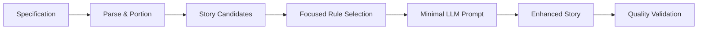
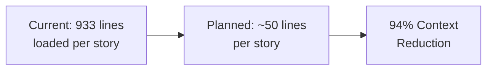

# LLM vs Code-Based Generation

A detailed comparison of the current code-based story generation approach versus the planned LLM-driven Context-Smart approach.

## Current Implementation: Code-Based Generation

### How It Works
The current system uses pure Python string manipulation and templates:

```python
def _generate_story_for_persona_goal(self, spec_data, persona, goal):
    # Extract and clean data
    clean_persona_name = persona.name.replace('#', '').strip()
    primary_motivation = persona.motivations[0] if persona.motivations else "access the functionality"
    clean_goal = goal.goal.split(' - ')[0].strip()
    
    # Create story using template
    story = UserStory(
        title=f"{clean_persona_name} - {clean_goal}",
        description=f"As a {clean_persona_name}, I want to {primary_motivation} so that {clean_goal}",
        # ... more template-based generation
    )
```

### Current Architecture Issues

!!! warning "Context Rot Problem"
    **Problem**: Loads entire 933-line `gojko-adzic-patterns.json` but only uses tiny fragments
    
    ```python
    # Line 48: Loads massive pattern file
    self.gojko_patterns = self._load_gojko_patterns()  # 933 lines!
    
    # Line 163: Uses minimal fragment
    invest_patterns = self.gojko_patterns.get("invest_criteria_analysis", {})
    ```

### Code-Based Advantages ✅
- **Fast execution** (2-3 seconds per story)
- **100% deterministic** output
- **No API costs** or rate limiting
- **Reliable pattern matching**
- **Consistent terminology** application

### Code-Based Limitations ❌
- **Formulaic stories** with repetitive structure
- **Limited creativity** and natural variation  
- **Context Rot** from loading massive pattern files
- **Hard to handle edge cases** and nuanced requirements
- **Brittle pattern matching** that misses context

### Example Current Output
```
Story ID: STORY-9-045
Title: Premium Car Buyer - premium package sales by 15% within 6 months

User Story: 
As a Premium Car Buyer, I want to easily explore luxury options 
so that premium package sales by 15% within 6 months

Acceptance Criteria:
1. Given: I am a Premium Car Buyer
   When: I easily explore luxury options  
   Then: I can successfully premium package sales by 15% within 6 months
```

*Note: The repetitive structure and awkward phrasing in acceptance criteria*

## Planned Implementation: LLM-Driven Generation

### Context-Smart LLM Approach

The planned system follows Context-Smart principles with focused LLM prompts:



### How It Will Work

#### 1. Story Candidating
```python
def create_story_candidates(spec_data):
    candidates = []
    for persona in spec_data.personas:
        for goal in spec_data.business_goals:
            candidate = {
                'persona': persona.name,
                'motivation': persona.motivations[0],
                'goal': goal.goal,
                'context': extract_relevant_context(persona, goal)
            }
            candidates.append(candidate)
    return candidates
```

#### 2. Focused Rule Selection
```python
def select_relevant_rules(story_candidate):
    rules = []
    
    # Select only relevant Gojko patterns (not all 933 lines!)
    if needs_invest_analysis(story_candidate):
        rules.extend(['independence_check', 'value_clarity', 'size_appropriate'])
    
    if needs_bdd_structure(story_candidate):
        rules.extend(['given_when_then', 'acceptance_criteria'])
        
    if has_domain_context(story_candidate):
        rules.extend([f'{domain}_terminology_rules'])
    
    return rules[:50]  # Maximum 50 lines of focused rules
```

#### 3. Context-Smart LLM Prompting
```python
def generate_story_via_llm(story_candidate, focused_rules):
    prompt = f"""
Story Candidate:
- Persona: {story_candidate.persona}
- Motivation: {story_candidate.motivation}  
- Goal: {story_candidate.goal}

Apply these specific rules:
{format_focused_rules(focused_rules)}

Generate a natural, high-quality user story with proper acceptance criteria.
"""
    
    # Send minimal prompt (< 1000 tokens vs 4000+ current)
    return call_llm_with_focused_prompt(prompt)
```

### LLM-Driven Advantages ✅
- **Natural language generation** with varied, readable stories
- **Context-Smart approach** (50 lines of rules vs 933 lines)  
- **Better edge case handling** through contextual understanding
- **Improved story quality** with nuanced language
- **Adaptive generation** that learns from context

### LLM-Driven Challenges ❌
- **API costs** and rate limiting considerations
- **Latency** (5-10 seconds per story vs 2-3 seconds)
- **Less deterministic** output (85-95% consistency vs 100%)
- **Requires validation** of LLM outputs
- **Network dependency** for generation

## Performance Comparison

| Aspect | Code-Based (Current) | LLM-Driven (Planned) |
|--------|---------------------|----------------------|
| **Speed** | 2-3 seconds/story | 5-10 seconds/story |
| **Context Size** | 933 lines loaded | ~50 lines per story |
| **Memory Usage** | High (full patterns) | Low (focused rules) |
| **Story Quality** | Formulaic, consistent | Natural, varied |
| **API Costs** | $0 | ~$0.01-0.05 per story |
| **Determinism** | 100% | 85-95% |
| **Maintenance** | High (brittle patterns) | Low (adaptive) |

## Quality Comparison Examples

=== "Code-Based Output"
    ```
    As a Premium Car Buyer, I want to easily explore luxury options 
    so that premium package sales by 15% within 6 months
    
    Given: I am a Premium Car Buyer
    When: I easily explore luxury options
    Then: I can successfully premium package sales by 15% within 6 months
    ```
    
    **Issues**: Repetitive phrasing, awkward goal integration, template-like structure

=== "LLM-Enhanced Output (Planned)"
    ```
    As a Premium Car Buyer, I want to explore comprehensive luxury 
    customization options with clear pricing and availability 
    so that I can make informed decisions about premium packages 
    that align with my preferences and budget.
    
    Given: I am viewing the premium configuration section
    When: I explore luxury options with detailed specifications
    Then: I can see clear pricing, availability, and customization choices
    And: I can save my preferred configurations for comparison
    ```
    
    **Improvements**: Natural language, specific context, actionable criteria

## Context Management Strategy

### Current Context Heavy Approach
```python
# ❌ Loads everything for minimal usage
def __init__(self):
    self.gojko_patterns = self._load_gojko_patterns()  # 933 lines
    # Uses maybe 10-15 lines per story
```

### Planned Context Smart Approach  
```python
# ✅ Loads only what's needed per story
def generate_enhanced_story(story_candidate):
    relevant_rules = select_focused_rules(story_candidate)  # ~50 lines
    enhanced_story = llm_generate(story_candidate, relevant_rules)
    return enhanced_story
```

### Context Size Reduction


## Implementation Strategy

### Phase 1: Parallel Implementation
- Implement LLM generation alongside existing code generation
- A/B testing framework for quality comparison
- Gradual rollout with fallback to code-based approach

### Phase 2: Hybrid Approach
- Use LLM for complex/nuanced stories
- Use code generation for simple/standard stories  
- Dynamic selection based on story complexity

### Phase 3: Full Migration
- Replace code generation with LLM approach
- Maintain code generation as backup/offline mode
- Optimize LLM prompts based on usage patterns

## Decision Framework

### When to Use Code-Based Generation
- **High-volume batch processing** (speed priority)
- **Offline operation** required
- **Cost-sensitive** environments
- **Simple, template-friendly** requirements

### When to Use LLM-Driven Generation  
- **Quality-first** story generation
- **Complex/nuanced** requirements
- **Natural language** priority  
- **Context-smart** processing needed

## Future Enhancements

### Advanced LLM Integration
- **Few-shot learning** with domain examples
- **Chain-of-thought** prompting for complex stories
- **Iterative refinement** based on validation feedback
- **Multi-model** ensemble for optimal quality

### Optimization Strategies
- **Prompt caching** for repeated patterns
- **Batch processing** for multiple stories
- **Local LLM deployment** for cost optimization
- **Smart fallback** to code generation when appropriate

---

!!! tip "Best of Both Worlds"
    The planned hybrid approach combines:
    
    - **Code-based reliability** for standard cases
    - **LLM creativity** for complex scenarios  
    - **Context-smart efficiency** for optimal performance
    - **Quality validation** ensuring consistent output