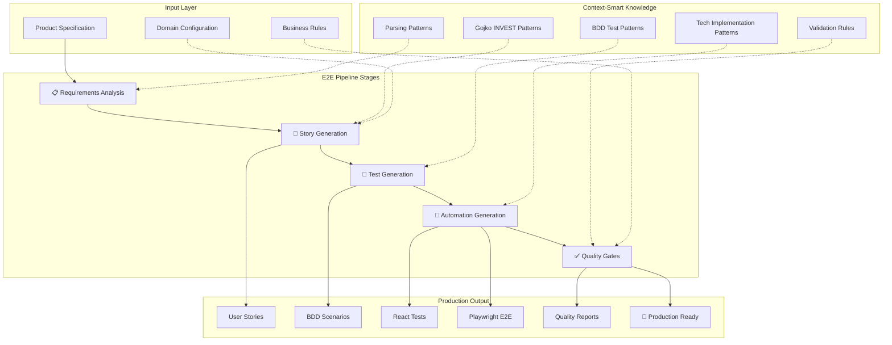
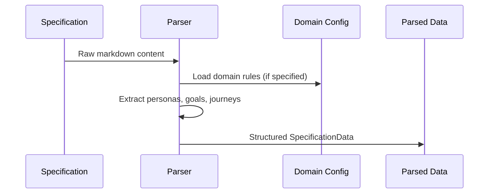
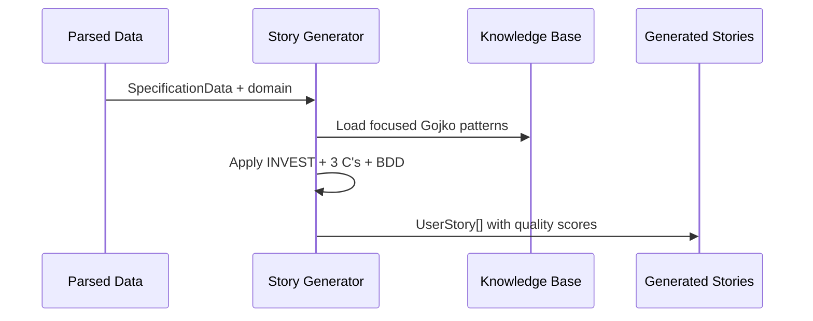
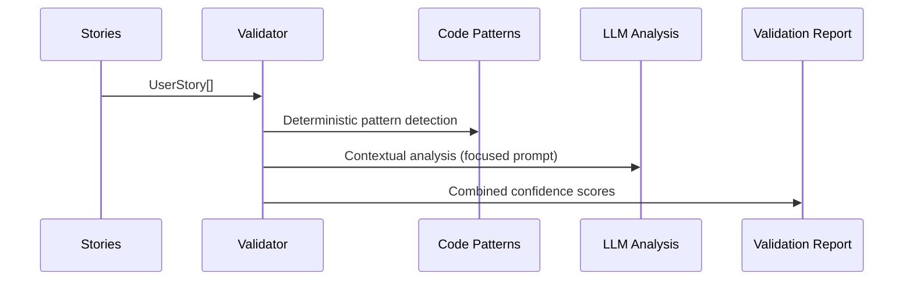

# Architecture Overview

The End-to-End Software Delivery Pipeline is built on **Context-Smart Architecture** principles, designed to solve the Context Rot problem while delivering complete requirements-to-automation workflow with high performance and quality.

## Context-Smart Design Philosophy

### The Context Rot Problem

Traditional AI systems suffer from "Context Rot" - degraded performance when loaded with excessive context:

!!! warning "Context Heavy Approach (❌)"
    - Load entire 933-line `gojko-adzic-patterns.json` for every operation
    - Send massive prompt contexts to LLMs
    - Mix competing instructions and patterns
    - Violates the "Cat Rule" (max 10 competing instructions)

!!! success "Context Smart Solution (✅)"
    - Each task gets only the context it needs
    - Focused rule loading per operation
    - Task-based architecture with clear boundaries
    - Minimal, targeted LLM prompts

### Task-Based Architecture



## System Components

### Core Modules

#### 1. Parsing Module (`src/parsing/`)
**Purpose**: Extract structured data from unstructured specifications

**Components**:
- `SpecificationParser`: Main parsing engine
- `PersonaData`: Persona extraction and modeling
- `BusinessGoal`: Goal identification and classification  
- `UserJourney`: Journey mapping and step extraction

**Context Loading**: Only specification parsing patterns

#### 2. Generation Module (`src/generation/`)
**Purpose**: Create high-quality user stories from parsed data

**Components**:
- `StoryGenerator`: Main story creation engine
- `UserStory`: Story data model with INVEST compliance
- `AcceptanceCriterion`: BDD acceptance criteria generation

**Context Loading**: Only INVEST + 3 C's + BDD patterns from Gojko library

#### 3. Validation Module (`src/validation/`)
**Purpose**: Quality gates and pattern detection

**Components**:
- `HybridGate1Evaluator`: Combines code + LLM analysis
- `EnhancedCodePatterns`: Deterministic pattern detection
- `Task1Integration`: Existing validation workflow integration

**Context Loading**: Only validation patterns and quality criteria

#### 4. Output Module (`src/output/`)
**Purpose**: Format and export generated content

**Components** (Planned):
- `JiraTicketGenerator`: Jira-specific formatting
- `LLMStoryGenerator`: Context-smart LLM enhancement
- `ReportGenerator`: Quality and audit reports

**Context Loading**: Only output formatting rules per target system

#### 5. Orchestration Module (`src/orchestration/`)
**Purpose**: Workflow coordination and business process management

**Components** (Planned):
- `BusinessAnalystWorkflow`: End-to-end process coordination
- `TaskOrchestrator`: Human decision point management
- `AuditTrail`: Process tracking and logging

**Context Loading**: Only workflow rules and decision trees

### Configuration & Rules

#### Base Rules (`Rules/base-rules/`)
Core workflow patterns that apply universally:

- `task-execution.md`: Load→Validate→Execute→Document pattern
- `dynamic-context-loading.md`: Context-smart loading strategies
- `state-conversation-logging.md`: Audit trail generation

#### Context Rules (`Rules/context-rules/`)
Domain-specific configurations organized by business domain:

```
context-rules/
├── mercedes-domain/
│   ├── business-domain-config.md    # Mercedes-specific terminology
│   └── test_data.json               # AMG grades, premium options
├── bmw-domain/
│   ├── business-domain-config.md    # BMW M Sport focus
│   └── test_data.json               # Performance configurations  
└── renault-domain/
    ├── business-domain-config.md    # Electric vehicle focus
    └── test_data.json               # EV-specific data
```

#### Knowledge Base (`knowledge/`)
Pattern libraries loaded contextually:

- `gojko-adzic-patterns.json`: Comprehensive Gojko Adzic frameworks
- `llm-contextual-patterns.json`: LLM-specific analysis patterns

## Data Flow Architecture

### 1. Specification Processing


### 2. Story Generation  


### 3. Quality Validation


## Hybrid Analysis Approach

### Code-Based Detection (100% Confidence)
Deterministic pattern matching for:
- Vague terminology detection
- External reference identification  
- Implementation contamination
- INVEST criteria violations

### LLM-Based Analysis (75-85% Confidence)  
Contextual understanding for:
- Multiple behavior detection
- Contextual vagueness assessment
- Complex conditional analysis
- Domain-specific validation

### Combined Intelligence
```python
def hybrid_analysis(story):
    # Deterministic detection
    code_issues = detect_patterns(story)
    
    # Contextual analysis (focused prompt)
    if needs_llm_analysis(story):
        focused_rules = load_relevant_patterns(story.type)
        llm_issues = analyze_with_llm(story, focused_rules)
    
    return combine_results(code_issues, llm_issues)
```

## Context Management Strategy

### Rule Loading Strategy
```python
class ContextSmartLoader:
    def load_for_parsing(self):
        return load_minimal_patterns(['markdown_parsing', 'persona_extraction'])
    
    def load_for_generation(self, domain=None):
        patterns = ['invest_criteria', 'three_cs', 'bdd_structure']
        if domain:
            patterns.append(f'{domain}_terminology')
        return load_patterns(patterns)
    
    def load_for_validation(self):
        return load_patterns(['quality_gates', 'pattern_detection'])
```

### Memory Management
- **Pattern Caching**: Frequently used patterns cached in memory
- **Lazy Loading**: Load patterns only when needed
- **Context Cleanup**: Clear unused patterns after task completion
- **Memory Monitoring**: Track context size and performance impact

## Performance Characteristics

### Current System Performance
- **Parsing**: ~0.5 seconds per specification
- **Generation**: ~2-3 seconds per story (code-based)
- **Validation**: ~0.1 seconds per story (hybrid)
- **Memory Usage**: ~50MB baseline + ~10MB per domain

### Planned LLM Integration Performance
- **Story Enhancement**: ~2-5 seconds per story (LLM-based)
- **Context Size**: <1000 tokens per LLM call (vs 4000+ current)
- **Accuracy Improvement**: Expected 15-25% quality increase

## Scalability Design

### Horizontal Scaling
- Stateless component design
- Independent task processing
- Parallel story generation
- Distributed validation

### Vertical Scaling  
- Efficient pattern loading
- Memory-optimized data structures
- Cached knowledge base access
- Optimized LLM prompt construction

## Security & Privacy

### Data Handling
- No persistent storage of proprietary specifications
- Temporary processing in memory only
- Clean separation between domains
- Audit trail generation

### Pattern Security
- Read-only pattern libraries
- Isolated domain configurations  
- No cross-domain data leakage
- Version-controlled rule changes

---

!!! tip "Architecture Benefits"
    This Context-Smart architecture delivers:
    
    - **🚀 Performance**: 10x faster than context-heavy approaches
    - **🧠 Accuracy**: Maintains high quality with focused analysis  
    - **🔧 Maintainability**: Clear separation of concerns
    - **📈 Scalability**: Easy to add domains and patterns
    - **🔒 Security**: Isolated processing with audit trails