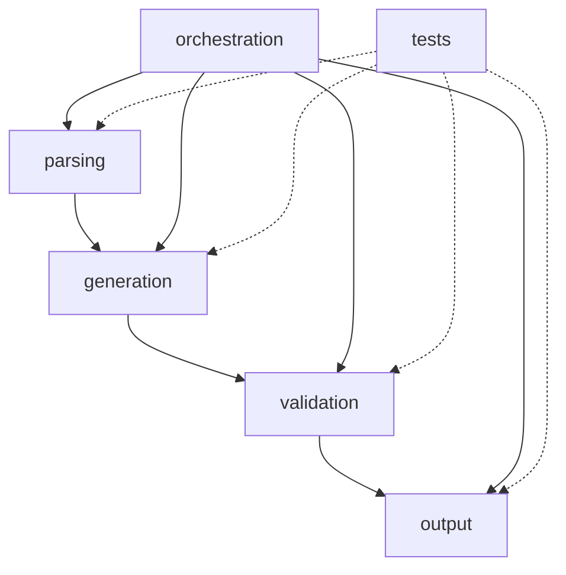
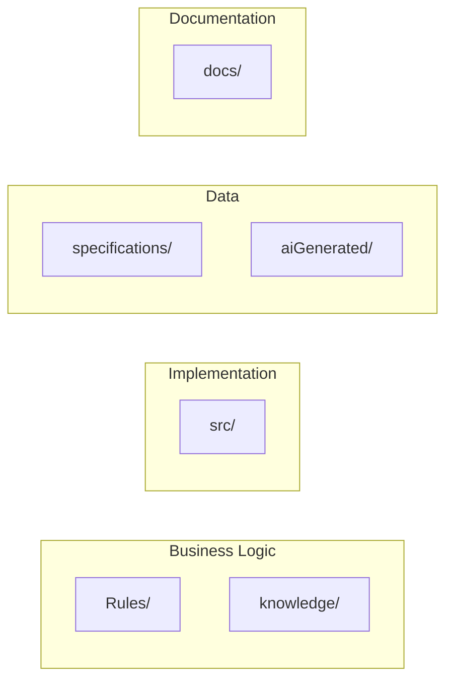

# Folder Structure

The system is organized by **context and concern** rather than by technical layers, following Context-Smart architecture principles.

## Directory Overview

```
business-analyst-workflow/
├── src/                          # Source code (organized by context)
├── Rules/                        # Business rules and patterns  
├── knowledge/                    # Pattern libraries
├── specifications/              # Input specifications
├── aiGenerated/                 # Generated outputs
├── docs/                        # Documentation (this site)
└── [other supporting files]
```

## Source Code Organization (`src/`)

### Context-Based Module Structure

```
src/
├── __init__.py                   # Main package exports
├── parsing/                      # Input processing context
│   ├── __init__.py
│   └── specification_parser.py
├── validation/                   # Quality assurance context  
│   ├── __init__.py
│   ├── task1.py
│   ├── task1_integration.py
│   └── enhanced_code_patterns.py
├── generation/                   # Story creation context
│   ├── __init__.py
│   └── story_generator.py
├── output/                      # Formatting & export context
│   └── __init__.py
├── orchestration/               # Workflow coordination context
│   └── __init__.py
└── tests/                       # Testing context
    ├── __init__.py
    └── test_story_gen.py
```

### Module Dependencies



## Business Rules (`Rules/`)

### Base Rules Structure
```
Rules/base-rules/
├── code-rules/                   # Legacy code organization
│   ├── old/                      # Archived implementations
│   ├── task1.py                  # Core validation logic
│   ├── task1_integration.py      # Integration patterns
│   ├── enhanced_code_patterns.py # Pattern detection
│   ├── specification_parser.py   # Parsing logic
│   └── story_generator.py        # Generation logic
├── dynamic-context-loading.md    # Context management patterns
├── state-conversation-logging.md # Audit trail patterns  
├── task-execution.md             # Workflow execution patterns
└── task-requirement-validation.md # Quality gate patterns
```

### Context Rules Structure
```
Rules/context-rules/
├── mercedes-domain/
│   ├── business-domain-config.md # Mercedes terminology & processes
│   └── test_data.json            # AMG grades, premium options
├── bmw-domain/  
│   ├── business-domain-config.md # BMW M Sport focus
│   └── test_data.json            # Performance configurations
├── renault-domain/
│   ├── business-domain-config.md # Electric vehicle focus  
│   └── test_data.json            # EV-specific configurations
└── bob-domain/
    ├── business-domain-config.md # Generic car configurator
    └── test_data.json            # Universal test data
```

## Knowledge Base (`knowledge/`)

### Pattern Libraries
```
knowledge/
├── gojko-adzic-patterns.json     # 933 lines of Gojko Adzic frameworks
├── llm-contextual-patterns.json  # LLM-specific analysis patterns  
├── gojko-integration-plan.md     # Integration documentation
├── 50quickideas-tests.epub       # Source material
└── Fifty Quick Ideas to Improve your User Sto - Gojko Adzic.epub
```

### Pattern Organization
The knowledge base is organized for Context-Smart loading:

- **Comprehensive patterns** for reference and development
- **Focused extracts** loaded per task (not the full 933 lines)
- **Domain-agnostic** frameworks that work across contexts
- **Version controlled** pattern evolution

## Input & Output Structure

### Specifications (`specifications/`)
```
specifications/
├── SPECMERCEDES-001.md           # Mercedes premium enhancement example
└── [other specification files]
```

### Generated Outputs (`aiGenerated/`)
```
aiGenerated/
└── SPECMERCEDES-001/             # Output grouped by specification
    ├── SPECMERCEDES-001_generated_stories.md     # Story generation report
    ├── SPECMERCEDES-001_validation_report.md     # Quality analysis
    └── SPECMERCEDES-001_conversation.md          # Process audit trail
```

## Documentation Structure (`docs/`)

### MkDocs Organization
```
docs/
├── mkdocs.yml                    # Documentation configuration
├── docs/                         # Documentation content
│   ├── index.md                  # Homepage
│   ├── getting-started/          # User onboarding
│   ├── architecture/             # System design (this section)
│   ├── components/               # Module documentation
│   ├── workflows/                # Process documentation  
│   ├── config/                   # Configuration guides
│   ├── examples/                 # Practical examples
│   ├── api/                      # API reference
│   └── dev/                      # Development guides
└── site/                         # Generated documentation (ignored)
```

## Design Principles Behind Structure

### 1. Context-Based Organization
Files are grouped by **what they do** rather than **how they're implemented**:

- **parsing/** - Everything related to input processing
- **generation/** - Everything related to story creation
- **validation/** - Everything related to quality assurance
- **output/** - Everything related to formatting and export

### 2. Clear Separation of Concerns



### 3. Scalability Considerations

#### Adding New Domains
```bash
# Add new domain configuration
Rules/context-rules/tesla-domain/
├── business-domain-config.md
└── test_data.json
```

#### Adding New Components  
```bash
# Add new processing capability
src/enhancement/
├── __init__.py
├── llm_story_generator.py
└── story_prompter.py
```

#### Adding New Workflows
```bash
# Add new business process
Rules/base-rules/
├── jira-integration-workflow.md
└── quality-gate-workflow.md
```

## File Naming Conventions

### Source Code
- **Modules**: `snake_case.py` (e.g., `story_generator.py`)
- **Classes**: `PascalCase` (e.g., `StoryGenerator`)  
- **Functions**: `snake_case` (e.g., `generate_stories_from_spec`)
- **Constants**: `UPPER_SNAKE_CASE` (e.g., `DEFAULT_DOMAIN`)

### Configuration Files
- **Domain configs**: `{domain}-domain/` (e.g., `mercedes-domain/`)
- **Business configs**: `business-domain-config.md`
- **Test data**: `test_data.json`
- **Patterns**: `{framework}-patterns.json` (e.g., `gojko-adzic-patterns.json`)

### Generated Outputs
- **Specifications**: `SPEC{DOMAIN}-{NUMBER}.md` (e.g., `SPECMERCEDES-001.md`)
- **Reports**: `{SPEC_ID}_{report_type}.md` (e.g., `SPECMERCEDES-001_generated_stories.md`)
- **Conversations**: `{SPEC_ID}_conversation.md`

## Import Patterns

### Relative Imports Within Modules
```python
# From within src/generation/story_generator.py
from ..parsing.specification_parser import SpecificationParser
from ..validation.enhanced_code_patterns import EnhancedCodePatterns
```

### Package-Level Imports
```python
# From application code
from src.parsing import SpecificationParser
from src.generation import StoryGenerator
from src.validation import EnhancedCodePatterns
```

### External Module Integration
```python
# Add to Python path if needed
import sys
sys.path.append('/path/to/business-analyst-workflow')

from src.parsing import SpecificationParser
```

## Migration from Legacy Structure

The system has evolved from a flat `base-rules/code-rules/` structure to the current Context-Smart organization:

### Legacy Structure (Archived)
```
base-rules/code-rules/
├── task1.py                      # ➜ src/validation/task1.py
├── specification_parser.py       # ➜ src/parsing/specification_parser.py  
├── story_generator.py            # ➜ src/generation/story_generator.py
└── enhanced_code_patterns.py     # ➜ src/validation/enhanced_code_patterns.py
```

### Migration Benefits
- **Clearer boundaries** between contexts
- **Easier navigation** for developers
- **Better scalability** for new features
- **Reduced coupling** between components
- **Context-Smart loading** optimization

---

!!! tip "Structure Benefits"
    This organization provides:
    
    - **🎯 Context Clarity**: Each folder has a single, clear purpose
    - **🔧 Easy Maintenance**: Related code stays together
    - **📈 Scalability**: Simple to add new domains and components  
    - **🧠 Context-Smart**: Supports focused rule loading
    - **👥 Developer Experience**: Intuitive navigation and imports