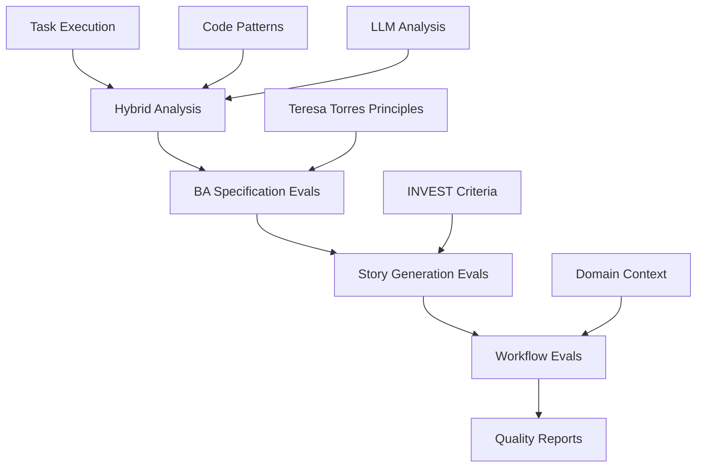

# Evaluation System (Evals)

**Teresa Torres-inspired evaluation system** for systematic AI quality measurement and improvement, now integrated with conversational task workflows.

## Overview

The evaluation system provides comprehensive quality assessment for Business Analyst (BA) workflows, BDD generation, and task automation. Built on Teresa Torres principles of simple, focused evaluation targeting the biggest failure modes.

### Architecture



## Core Evaluation Modules

### 1. Specification Analysis Evals (`spec_analysis_evals.py`)

**Purpose**: Validate specification document quality and completeness

#### `eval_specification_structure(spec_data: SpecificationData) -> EvalResult`
- **Validates**: Overall document organization and required sections
- **Checks**: Personas, business goals, user journeys, constraints presence
- **Threshold**: Pass/Fail based on critical section availability
- **Integration**: Called in Task 1 BA analysis pipeline

#### `eval_persona_extraction_completeness(spec_data: SpecificationData) -> EvalResult`
- **Validates**: Persona data completeness and quality
- **Checks**: Role, motivations, context fields for each persona
- **Failure Modes**: Missing roles, empty motivations, vague contexts
- **Output**: Detailed breakdown of incomplete persona data

#### `eval_business_goal_clarity(spec_data: SpecificationData) -> EvalResult`
- **Validates**: Business goal measurability and clarity
- **Checks**: Success criteria presence, measurable metrics, specific outcomes
- **Failure Modes**: Vague goals ("make things better"), missing metrics
- **Quality Gates**: Goals must have concrete success criteria

### 2. Story Generation Evals (`story_generation_evals.py`)

**Purpose**: Validate user story quality using INVEST criteria and traceability

#### `eval_invest_compliance_threshold(stories: List[UserStory]) -> EvalResult`
- **Validates**: Stories meet INVEST quality threshold (>0.8)
- **Uses**: Existing `invest_score` calculation from story generator
- **Threshold**: 0.8+ score required for pass
- **Integration**: Leverages proven INVEST scoring algorithm

#### `eval_story_traceability(stories: List[UserStory], spec_data: SpecificationData) -> EvalResult`
- **Validates**: Stories properly map to specification personas
- **Checks**: Every story persona exists in original specification
- **Failure Modes**: Orphaned stories, invented personas, missing mappings
- **Quality**: Ensures end-to-end spec-to-story consistency

#### `eval_acceptance_criteria_quality(stories: List[UserStory]) -> EvalResult`
- **Validates**: Given-When-Then BDD structure and testability
- **Checks**: Proper BDD format, testable conditions, user-observable outcomes
- **Integration**: Works with existing BDD generation patterns
- **Quality Gates**: All criteria must follow Given-When-Then structure

### 3. BA Workflow Evals (`ba_workflow_evals.py`)

**Purpose**: End-to-end workflow validation and meta-evaluation

#### `eval_specification_to_story_flow(spec_data: SpecificationData, stories: List[UserStory]) -> EvalResult`
- **Validates**: Complete pipeline from specification to stories
- **Orchestrates**: All component evaluations with quality scoring
- **Calculates**: Overall workflow quality (0-100 scale)
- **Integration**: Primary evaluation for complete BA workflows

#### `eval_domain_context_consistency(spec_data: SpecificationData, stories: List[UserStory], domain: str) -> EvalResult`
- **Validates**: Domain-specific terminology consistency
- **Supports**: Mercedes, BMW, Renault domain contexts
- **Checks**: Appropriate domain language in specifications and stories
- **Quality**: Maintains brand consistency across artifacts

#### `eval_quality_feedback_loops(spec_data: SpecificationData, stories: List[UserStory]) -> EvalResult`
- **Validates**: System provides actionable improvement recommendations
- **Meta-evaluation**: Evaluates the evaluation system itself
- **Checks**: Quality notes, improvement suggestions, feedback mechanisms
- **Purpose**: Ensures continuous improvement capability

## Integration with Conversational Tasks

### Enhanced Task 1: `execute task 1 for TICKET-123`

**Traditional Flow**:
1. Load ticket data
2. Apply domain context
3. Run hybrid evaluation (code + LLM)
4. Generate validation report

**Enhanced with BA Evals**:
1. Load ticket data
2. Apply domain context  
3. Run hybrid evaluation (code + LLM)
4. **NEW**: Run BA specification analysis
   - `eval_specification_structure`
   - `eval_persona_extraction_completeness` 
   - `eval_business_goal_clarity`
5. Generate enhanced validation report with BA quality section

### Validation Report Enhancement

Traditional reports now include comprehensive BA analysis:

```markdown
## BA Specification Quality Analysis

**Overall BA Quality**: 85.0/100 ✅ PASSED

### Business Analysis Evaluations

**Specification Structure**: ✅ PASS
- All required sections present with appropriate detail

**Persona Completeness**: ✅ PASS  
- All personas complete with required fields

**Goal Clarity**: ✅ PASS
- Business goals have clear success criteria and metrics

### Extracted Specification Elements
- **Personas**: 3
- **Business Goals**: 2  
- **User Journeys**: 5
- **Constraints**: 4
- **Assumptions**: 2
```

## Quality Thresholds and Scoring

### Evaluation Thresholds

| Evaluation | Pass Criteria | Scoring Method |
|------------|---------------|----------------|
| **Specification Structure** | All critical sections present | Pass/Fail |
| **Persona Completeness** | All personas have role, motivations, context | Pass/Fail |
| **Business Goal Clarity** | Goals have success criteria + metrics | Pass/Fail |
| **INVEST Compliance** | Average story score >0.8 | Numeric threshold |
| **Story Traceability** | All stories map to spec personas | Pass/Fail |
| **Overall BA Quality** | Combined score from all evaluations | 0-100 scale |

### Overall Quality Calculation

```python
def _calculate_ba_quality_score(ba_results: Dict[str, Any]) -> float:
    scores = []
    for eval_name, result in ba_results.items():
        if hasattr(result, 'status'):
            # Convert PASS/FAIL to score (PASS=100, FAIL=0)
            scores.append(100.0 if result.status == "PASS" else 0.0)
    
    return sum(scores) / len(scores) if scores else 0.0
```

**Quality Gates**:
- **≥80**: Excellent quality, ready to proceed
- **60-79**: Good quality with minor improvements needed  
- **40-59**: Moderate quality, address issues before proceeding
- **<40**: Poor quality, significant improvements required

## Testing Framework

### Comprehensive Test Suite (`test_ba_evals.py`)

**Test Classes**:
- `TestSpecificationAnalysis`: Tests for specification evaluation functions
- `TestStoryGeneration`: Tests for story quality evaluation functions  
- `TestBAWorkflow`: Tests for end-to-end workflow evaluations
- `TestIntegration`: Tests for system integration and consistency

**Real-World Testing**:
```python
def test_end_to_end_ba_workflow_with_real_data(self):
    """Test complete BA workflow with real Mercedes specification."""
    spec_path = Path(__file__).parent / "specifications" / "SPECMERCEDES-001.md"
    
    with open(spec_path, 'r') as f:
        content = f.read()
    
    # Parse specification and generate stories
    spec_data = self.parser.parse_specification(content, 'PYTEST-001')
    stories = self.generator.generate_stories_from_spec(spec_data, 'mercedes')
    
    # Test workflow evaluation
    workflow_result = eval_specification_to_story_flow(spec_data, stories)
    
    assert workflow_result.eval_name == "eval_specification_to_story_flow"
    assert "workflow" in workflow_result.message.lower()
    assert len(stories) > 0
```

### Running Tests

```bash
# Run complete BA evaluation test suite
python3 -m pytest test_ba_evals.py -v

# Run specific evaluation category
python3 -m pytest test_ba_evals.py::TestSpecificationAnalysis -v

# Run with real specification data
python3 -m pytest test_ba_evals.py::TestBAWorkflow::test_end_to_end_ba_workflow_with_real_data -v
```

## Teresa Torres Key Principles Applied

### "I know when I can measure something I can improve it"
- ✅ **Systematic measurement** instead of "vibe checking"
- ✅ **Clear pass/fail criteria** for AI quality  
- ✅ **Data-driven improvement** decisions

### Start Simple, Add Complexity
- ✅ **Basic Python functions** before sophisticated tools
- ✅ **CSV storage** instead of complex frameworks
- ✅ **Domain knowledge** over generic solutions

### Fast Feedback Loops  
- ✅ **Real-time evaluation** during task execution
- ✅ **Immediate quality signals** in conversational workflow
- ✅ **Prevent quality regressions** through systematic checks

### Human Judgment on Final Decisions
- ✅ **AI identifies issues**, humans decide priorities
- ✅ **Eval validation** through human annotation
- ✅ **Context-smart eval design** needs domain expertise

## Error Handling and Resilience

### Graceful Degradation
```python
# Check if BA evaluations are available
if not BA_EVALS_AVAILABLE:
    print("   ℹ️ BA evaluations not available, skipping analysis")
    return {"status": "SKIP", "message": "BA evaluation modules not available"}
```

### Content Detection
```python
# Check if ticket contains specification-like elements
spec_indicators = ['persona', 'user journey', 'business goal', 'stakeholder', 'requirement']
has_spec_content = any(indicator in description.lower() for indicator in spec_indicators)

if not has_spec_content and len(description) < 200:
    return None  # Too simple for specification analysis
```

### Status Messaging
- **COMPLETED**: Full evaluation successful with results
- **SKIP**: Content not suitable for BA analysis  
- **ERROR**: Technical failure during evaluation

## Future Enhancements

### Planned Integrations

1. **Task 2 BDD Enhancement**: Add story quality validation during BDD generation
2. **Complete BA Command**: New `execute ba analysis for [SPEC]` conversational command
3. **Quality Metrics Dashboard**: Visual quality tracking over time
4. **Automated Improvement Suggestions**: AI-powered recommendations for quality issues

### Evaluation Expansion

- **Cross-domain validation**: Ensure patterns work across Mercedes/BMW/etc.
- **Performance metrics**: Story generation speed vs quality tradeoffs
- **User acceptance prediction**: Likelihood of story approval
- **Implementation complexity**: Development effort estimation

## Quick Reference

### Key Files
- `evals/spec_analysis_evals.py` - Specification quality validation
- `evals/story_generation_evals.py` - Story INVEST compliance + traceability  
- `evals/ba_workflow_evals.py` - End-to-end workflow orchestration
- `test_ba_evals.py` - Comprehensive test suite
- `src/validation/task1_integration.py` - Conversational integration

### Key Commands
```bash
# Test evaluation system
python3 -m pytest test_ba_evals.py -v

# Run enhanced Task 1 with BA integration
# (Through conversational interface)
execute task 1 for CARCONF-104
```

### Key Quality Gates
- **BA Quality Score**: ≥60 for pass, ≥80 for excellent
- **INVEST Threshold**: >0.8 average for story quality
- **Persona Completeness**: All personas need role + motivations + context
- **Goal Measurability**: All business goals need success criteria + metrics

**Result**: Transform task management from "hoping AI works" to "knowing AI quality" with systematic measurement and continuous improvement.