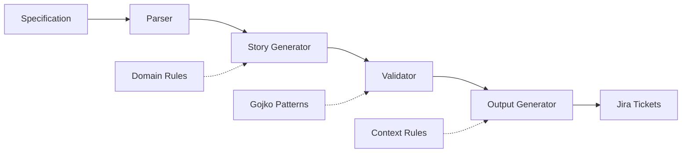

# Overview

Welcome to the **Business Analyst Workflow System** - a Context-Smart solution for converting messy product specifications into high-quality, INVEST-compliant user stories and Jira tickets.

## What Problem Does This Solve?

Business analysts constantly face the challenge of transforming vague product requirements into actionable development tickets. This system automates that process using proven frameworks and Context-Smart architecture.

### Before This System
❌ Manual story writing takes hours  
❌ Inconsistent story quality  
❌ Missing INVEST compliance  
❌ No standardized acceptance criteria  
❌ Domain terminology inconsistencies  

### After This System  
✅ **Automated story generation** in minutes  
✅ **INVEST-compliant stories** using Gojko Adzic patterns  
✅ **Consistent BDD acceptance criteria** with Given-When-Then  
✅ **Domain-specific terminology** (Mercedes, BMW, etc.)  
✅ **Jira-ready output** with proper formatting  

## Core Principles

### 1. Context-Smart Architecture
Based on research into **Context Rot**, this system follows a task-based approach where each component gets only the context it needs.

!!! tip "Context Smart vs Context Heavy"
    **Context Heavy** ❌: Load 933-line pattern files for every operation  
    **Context Smart** ✅: Each task gets focused, minimal context

### 2. Proven Frameworks Integration
- **INVEST criteria** for story quality
- **3 C's framework** (Card, Conversation, Confirmation)  
- **BDD structure** with Given-When-Then acceptance criteria
- **Gojko Adzic patterns** from "50 Quick Ideas to Improve User Stories"

### 3. Hybrid Analysis Approach
Combines deterministic pattern detection with contextual LLM analysis:
- **Code-based validation** (100% confidence) - vague terms, external references
- **LLM-based analysis** (75-85% confidence) - contextual understanding, complex scenarios

## System Components



| Component | Purpose | Status |
|-----------|---------|--------|
| **Specification Parser** | Extract personas, goals, journeys from specs | ✅ Complete |
| **Story Generator** | Create INVEST-compliant stories | ✅ Complete |  
| **Validation System** | Quality gates and pattern detection | ✅ Complete |
| **Output Generator** | Format for Jira and other systems | 🔄 In Progress |
| **Workflow Orchestration** | End-to-end process management | 📋 Planned |

## Quick Example

Input specification containing personas and business goals gets transformed:

=== "Input"
    ```markdown
    ## Personas
    ### Premium Car Buyer
    - Wants luxury customization options
    - Values premium experience
    
    ## Business Goals
    - Increase premium package sales by 15%
    ```

=== "Generated Story"
    ```
    **Story ID**: STORY-9-045
    **Title**: Premium Car Buyer - Increase premium package sales
    
    **User Story**: 
    As a Premium Car Buyer, I want to easily explore luxury options 
    so that I can make informed decisions about premium packages
    
    **Acceptance Criteria**:
    1. Given: I am a Premium Car Buyer
       When: I easily explore luxury options  
       Then: I can successfully increase premium package sales
    
    **INVEST Score**: 0.98/1.0
    **Priority**: high
    ```

## What's Next?

- **[Quick Start](quickstart.md)** - Get up and running in 5 minutes
- **[Installation](installation.md)** - Detailed setup instructions
- **[Architecture Overview](../architecture/overview.md)** - Deep dive into Context-Smart design

---

!!! success "Ready to Get Started?"
    This system is production-ready for specification parsing and story generation.  
    LLM-driven enhancements and Jira integration are currently in development.