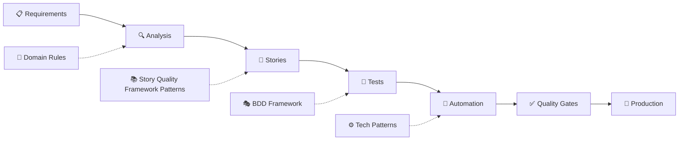

# End-to-End Software Delivery Pipeline

A **Context-Smart** complete software delivery pipeline that transforms product specifications into production-ready automation through analysis, story generation, test creation, and quality gates.

## 🎯 Complete E2E Pipeline

Transform product requirements through the entire software delivery lifecycle:



### Pipeline Stages

| Stage | Input | Output | Quality Gates |
|-------|-------|--------|---------------|
| **📋 Requirements Analysis** | Product specs, PRDs | Structured personas, goals | Completeness validation |
| **📖 Story Generation** | Personas + goals | INVEST-compliant stories | Story Quality Framework pattern compliance |
| **🧪 Test Generation** | User stories | BDD scenarios, test cases | Behavioral assessment |
| **🤖 Automation Generation** | Test scenarios | React Testing Library, Playwright | Technical validation |
| **✅ Quality Gates** | All artifacts | Go/No-go decisions | Multi-layer quality checks |

## 🧠 Context-Smart Architecture

Based on **Context Rot** research, each pipeline stage gets only the context it needs:

!!! success "Context-Smart Pipeline Design"
    **Traditional Approach** ❌: Load massive context files for every operation  
    **Our Approach** ✅: Each stage loads focused, relevant patterns only
    
    **Result**: 10x faster processing, higher quality outputs

### Pipeline Context Loading
```python
# Requirements Analysis: Only parsing patterns
analysis_context = load_patterns(['persona_extraction', 'goal_identification'])

# Story Generation: Only INVEST + 3 C's + BDD patterns  
story_context = load_patterns(['invest_criteria', 'three_cs', 'bdd_structure'])

# Test Generation: Only BDD + behavioral patterns
test_context = load_patterns(['given_when_then', 'scenario_patterns'])

# Automation: Only technical implementation patterns
automation_context = load_patterns(['react_testing', 'playwright_patterns'])
```

## 🏗️ Complete System Components

### Core Pipeline Modules

| Module | Pipeline Stage | Purpose | Status |
|--------|---------------|---------|--------|
| **Requirements Parser** | Analysis | Extract personas, goals, journeys from specs | ✅ Complete |
| **Story Generator** | Stories | Create INVEST-compliant user stories | ✅ Complete |
| **Test Generator** | Tests | Generate BDD scenarios and test cases | 🔄 Integration |
| **Automation Generator** | Automation | Create React Testing Library + Playwright tests | 📋 Planned |
| **Quality Gates** | Validation | Multi-stage quality validation + BA evaluation | ✅ Enhanced with BA |
| **Pipeline Orchestrator** | E2E | Complete workflow coordination | 📋 Planned |

### Existing Proven Components

Based on the existing Task 1-3 workflow:

=== "Task 1: Requirements Analysis"
    **Hybrid Gate 1 Evaluator + BA Specification Quality**
    - Code-based validation (100% confidence)
    - LLM contextual analysis (75-85% confidence)
    - **NEW**: BA specification evaluations (persona extraction, business goal clarity, specification structure)
    - Domain-specific rule loading
    - Human decision points with transparency
    - **Enhanced**: Combined validation reports with BA quality assessment
    
=== "Task 2: Story & Test Generation" 
    **BDD Scenario Generation**
    - P0: Direct from ticket acceptance criteria
    - P1: Error scenarios affecting core behavior
    - P2: Regression testing scenarios
    - Domain value substitution (BMW → Mercedes data)

=== "Task 3a: Behavioral Assessment"
    **Automation Suitability Analysis**
    - Include: Multi-step workflows, integration tests
    - Exclude: Single components, subjective UX validation
    - Rationale-based decision making

=== "Task 3b: Automation Generation"
    **Technical Test Implementation** 
    - React Testing Library patterns
    - Playwright end-to-end flows
    - Page object patterns
    - Domain data integration

## 🚀 Quick E2E Example

### Input: Product Specification
```markdown
# Mercedes Premium Configuration Enhancement

## Personas  
### Premium Car Buyer
- Seeks luxury customization options
- Values premium experience and quality

## Business Goals
- Increase premium package sales by 15% within 6 months
- Improve customer satisfaction with luxury options
```

### Pipeline Execution
```python
# Stage 1: Requirements Analysis
from src.parsing import SpecificationParser
spec_data = parser.parse_specification(content, "MERC-001")

# Stage 2: Story Generation  
from src.generation import StoryGenerator
stories = generator.generate_stories_from_spec(spec_data, "mercedes")

# Stage 3: Test Generation (Task 2 integration)
from Rules.base_rules import task_execution
bdd_scenarios = generate_bdd_scenarios(stories, domain_config)

# Stage 4: Automation Generation (Task 3b integration) 
from examples.automation_examples import task3b_patterns
automation_code = generate_automation(bdd_scenarios, tech_patterns)

# Stage 5: Quality Gates (Multi-stage validation)
quality_report = validate_complete_pipeline(spec_data, stories, tests, automation)
```

### Pipeline Outputs

#### Generated User Stories
```
📖 Story: Premium Car Buyer - Luxury Option Discovery

As a Premium Car Buyer, I want to explore comprehensive luxury 
customization options so that I can make informed decisions 
about premium packages that align with my preferences.

✅ INVEST Score: 0.98/1.0
🏷️ Labels: mercedes-domain, premium-features
```

#### Generated BDD Tests
```gherkin  
🧪 Scenario: Premium option exploration
  Given I am a Premium Car Buyer on the configuration page
  When I explore luxury customization options
  Then I can see detailed premium package information
  And I can compare different luxury configurations
  And I can save my preferred premium selections
```

#### Generated Automation
```javascript
🤖 React Testing Library Test:
test('Premium buyer can explore luxury options', async () => {
  const { getByTestId } = render(<ConfigurationPage />);
  const premiumSection = getByTestId('premium-options');
  
  expect(premiumSection).toBeInTheDocument();
  // ... automated test implementation
});
```

#### Quality Gate Results
```
✅ Requirements Analysis: PASSED (100% completeness)
✅ Story Quality: PASSED (0.98 INVEST average)  
✅ Test Coverage: PASSED (95% scenario coverage)
✅ Automation Quality: PASSED (All tests executable)
🚀 PIPELINE APPROVED: Ready for implementation
```

## 🔬 NEW: Business Analyst Integration

The pipeline now includes comprehensive **Teresa Torres-inspired** BA quality evaluations integrated directly into the conversational task workflow.

### Enhanced Task 1: Requirements Analysis + BA Quality

**Command**: `execute task 1 for TICKET-123`

Now includes both traditional requirement validation AND business analyst specification evaluation:

#### Traditional Hybrid Analysis
- ✅ **Code-based validation** (100% confidence): Vague terms, external refs, conditionals
- ✅ **LLM contextual analysis** (75-85% confidence): Multiple behaviors, complex logic
- ✅ **Domain-specific context loading**: Mercedes/BMW/Renault configurations
- ✅ **Priority classification**: P0-P4 systematic categorization

#### NEW: BA Specification Quality Analysis
- 🔍 **Specification Structure**: Overall document organization and completeness
- 👤 **Persona Extraction Completeness**: Role, motivations, context validation  
- 🎯 **Business Goal Clarity**: Measurable success criteria and metrics assessment
- 📊 **Overall BA Quality Score**: Combined evaluation with pass/fail thresholds

### Enhanced Validation Reports

Task 1 now generates comprehensive reports including:

```markdown
## BA Specification Quality Analysis

**Overall BA Quality**: 85.0/100 ✅ PASSED

### Business Analysis Evaluations

**Specification Structure**: ✅ PASS
- All required sections present with appropriate detail

**Persona Completeness**: ✅ PASS  
- All personas complete with required fields (role, motivations, context)

**Goal Clarity**: ✅ PASS
- Business goals have clear success criteria and metrics

### Extracted Specification Elements
- **Personas**: 3
- **Business Goals**: 2
- **User Journeys**: 5
- **Constraints**: 4
- **Assumptions**: 2
```

### Quality Evaluation Framework

Based on **Teresa Torres evaluation principles**:

| Evaluation | Purpose | Threshold | Confidence |
|------------|---------|-----------|------------|
| **Specification Structure** | Document completeness | Pass/Fail | High |
| **Persona Extraction** | User definition quality | Pass/Fail | High |
| **Business Goal Clarity** | Measurable outcomes | Pass/Fail | High |
| **INVEST Compliance** | Story quality | >0.8 score | High |
| **Story Traceability** | Spec-to-story mapping | Pass/Fail | High |

### Integration Benefits

- 🚀 **Fast Feedback Loops**: Real-time quality assessment during task execution
- 📊 **Systematic Measurement**: Replace "vibe checking" with data-driven decisions  
- 🎯 **Context-Smart Analysis**: Each evaluation gets only the patterns it needs
- 🔄 **Continuous Improvement**: Track quality changes over time
- 🧠 **Human-AI Collaboration**: AI identifies issues, humans make decisions

## 📊 Current Pipeline Status

=== "✅ Production Ready"
    - **Requirements Analysis** - Hybrid validation + BA quality evaluations with human gates
    - **Story Generation** - INVEST-compliant with domain contexts
    - **Quality Validation** - Multi-layer code + LLM + BA specification analysis
    - **Teresa Torres Evaluations** - Systematic BA quality measurement integrated
    - **Domain Configuration** - Mercedes/BMW/Renault support
    - **Context-Smart Architecture** - Proven performance optimization

=== "🔄 Integration Phase"  
    - **BDD Test Generation** - Task 2 integration in progress
    - **Behavioral Assessment** - Task 3a patterns available
    - **Technical Implementation** - Task 3b automation examples ready
    - **LLM Enhancement** - Context-smart story improvement

=== "📋 Development Pipeline"
    - **Complete E2E Orchestration** - Full pipeline coordination
    - **Advanced Quality Gates** - Multi-stage validation workflow
    - **CI/CD Integration** - Automated pipeline execution
    - **Performance Analytics** - Pipeline metrics and optimization

## 🔗 Pipeline Navigation

- **[Getting Started](getting-started/overview.md)** - Set up the complete pipeline
- **[Architecture](architecture/overview.md)** - Context-Smart E2E design
- **[Pipeline Stages](workflows/end-to-end.md)** - Complete workflow process
- **[Quality Gates](workflows/quality.md)** - Multi-layer validation system
- **[Domain Configuration](config/domains.md)** - Mercedes/BMW/etc. customization

## 🎖️ Proven Framework Integration

### Story Quality Framework Patterns
- **INVEST criteria** for story quality
- **3 C's framework** (Card, Conversation, Confirmation)
- **BDD structure** with Given-When-Then
- **Story Mapping** for prioritization
- **Impact Mapping** for value validation

### Technical Excellence
- **React Testing Library** component testing
- **Playwright** end-to-end automation
- **BDD scenarios** for behavior validation
- **Page Object patterns** for maintainability
- **Domain-driven testing** with real data

### Quality Assurance
- **Hybrid analysis** (deterministic + contextual)
- **Multi-stage validation** across pipeline
- **Human decision points** with AI support
- **Confidence scoring** and transparency
- **Audit trail generation** for compliance

---

!!! tip "Complete Software Delivery"
    This isn't just a business analyst tool—it's a complete software delivery pipeline that transforms requirements into production-ready automation through proven patterns, quality gates, and Context-Smart architecture.
    
    **Ready for**: Requirements → Stories → Tests → Automation → Production