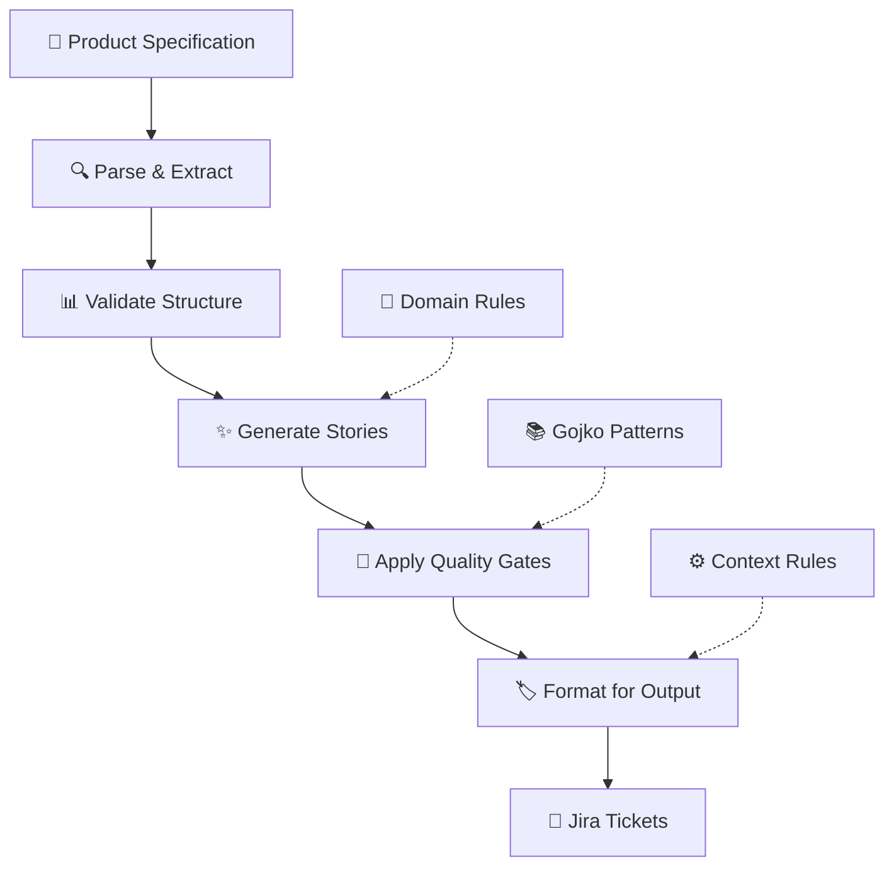

# End-to-End Workflow

Complete process flow from specification input to Jira ticket output in the Business Analyst Workflow System.

## Process Overview



## Phase 1: Specification Processing

### Input Requirements
- **Format**: Markdown specification file
- **Required Sections**: Personas, Business Goals
- **Optional Sections**: User Journeys, Constraints, Success Metrics

### Processing Steps
1. **Load Specification**: Read markdown content from file
2. **Parse Structure**: Extract personas, goals, journeys using Context-Smart patterns
3. **Validate Content**: Ensure required sections present and well-formed
4. **Generate Audit Trail**: Create conversation log for process tracking

### Example Input
```markdown
# Mercedes Premium Enhancement Specification

## Personas
### Premium Car Buyer
- Seeks luxury and customization options
- Values premium experience and quality

## Business Goals  
- Increase premium package sales by 15% within 6 months
- Improve customer satisfaction with luxury options
```

### Expected Output
```python
SpecificationData(
    spec_id="SPECMERCEDES-001",
    title="Mercedes Premium Enhancement Specification",
    personas=[PersonaData(name="Premium Car Buyer", ...)],
    business_goals=[BusinessGoal(goal="Increase premium package sales by 15%", ...)],
    ...
)
```

## Phase 2: Story Generation

### Context-Smart Generation
The system follows Context-Smart principles by loading only relevant patterns:

#### Current Approach (Code-Based)
```python
# Load focused patterns (not full 933-line file)
relevant_patterns = select_patterns(['invest_criteria', 'three_cs', 'bdd_structure'])

# Generate stories with domain context
stories = generator.generate_stories_from_spec(spec_data, domain="mercedes")
```

#### Planned Approach (LLM-Enhanced)
```python  
# Story candidating
candidates = create_story_candidates(spec_data)

# Focused rule selection per story
for candidate in candidates:
    focused_rules = select_relevant_rules(candidate)  # ~50 lines vs 933
    enhanced_story = llm_generate(candidate, focused_rules)
```

### Generation Process
1. **Create Story Matrix**: Persona × Business Goal combinations
2. **Apply INVEST Criteria**: Independence, Negotiability, Value, Estimability, Size, Testability
3. **Generate BDD Criteria**: Given-When-Then acceptance criteria
4. **Apply Domain Terminology**: Mercedes/BMW/etc. specific language
5. **Quality Scoring**: Rate stories using hybrid analysis

### Story Output Example
```
Story ID: STORY-9-045
Title: Premium Car Buyer - Increase premium package sales

User Story:
As a Premium Car Buyer, I want to easily explore luxury options 
so that I can make informed decisions about premium packages

Acceptance Criteria:
1. P0 - Given: I am a Premium Car Buyer
   When: I explore luxury options
   Then: I can see detailed customization choices with pricing

INVEST Score: 0.98/1.0
Priority: high
Domain: mercedes
```

## Phase 3: Quality Validation

### Hybrid Analysis Approach
Combines deterministic pattern detection with contextual LLM analysis:

#### Code-Based Detection (100% Confidence)
```python
def validate_with_patterns(story):
    issues = []
    
    # Vague terminology detection
    vague_terms = ['clear', 'good', 'better', 'improve']
    if any(term in story.description.lower() for term in vague_terms):
        issues.append(LanguageIssue.VAGUE_TERMINOLOGY)
    
    # External reference detection  
    if 'depends on' in story.description.lower():
        issues.append(LanguageIssue.EXTERNAL_REFERENCE)
        
    return issues
```

#### LLM-Based Analysis (75-85% Confidence)
```python
def validate_with_llm(story):
    # Context-Smart: Load only validation patterns needed
    focused_rules = load_validation_patterns(['multiple_behaviors', 'contextual_clarity'])
    
    prompt = f"""
    Story: {story.description}
    Rules: {focused_rules}
    
    Analyze for: multiple behaviors, contextual vagueness, complex conditionals
    """
    
    return llm_analyze(prompt)
```

### Validation Results
```python
ValidationResult(
    story_id="STORY-9-045",
    overall_score=0.98,
    code_issues=[],  # No deterministic issues found
    llm_issues=[],   # No contextual issues found  
    confidence_breakdown={
        'independence': 1.0,
        'negotiability': 1.0, 
        'value': 0.95,
        'estimability': 1.0,
        'size': 1.0,
        'testability': 0.98
    }
)
```

## Phase 4: Output Generation

### Current Output Formats
1. **Markdown Report**: Comprehensive story documentation
2. **Conversation Log**: Process audit trail  
3. **Quality Analysis**: INVEST compliance breakdown

### Planned Output Formats  
1. **Jira JSON**: Direct Jira import format
2. **CSV Export**: Spreadsheet compatibility
3. **Custom Formats**: Organization-specific templates

### Output Structure
```
aiGenerated/SPECMERCEDES-001/
├── SPECMERCEDES-001_generated_stories.md      # Full story report
├── SPECMERCEDES-001_validation_report.md      # Quality analysis
├── SPECMERCEDES-001_conversation.md           # Process log
└── SPECMERCEDES-001_jira_export.json         # Jira format (planned)
```

## Decision Points & Human Interaction

### Automated Decisions
- **Story generation**: Persona × Goal matrix creation
- **Pattern detection**: Code-based quality issues
- **Formatting**: Standard output generation
- **Domain application**: Terminology substitution

### Human Decision Points
- **Quality gate approval**: Accept/reject stories below threshold
- **Priority adjustment**: Modify P0/P1/P2 classifications
- **Story refinement**: Edit generated content before export
- **Export timing**: When to generate final outputs

### Decision Support
```python
def present_quality_gate_decision(stories):
    high_quality = [s for s in stories if s.invest_score >= 0.8]
    needs_review = [s for s in stories if s.invest_score < 0.6]
    
    print(f"✅ {len(high_quality)} stories ready for export")
    print(f"⚠️  {len(needs_review)} stories need review")
    
    return prompt_user_decision()
```

## Error Handling & Recovery

### Common Issues & Solutions

| Issue | Detection | Recovery Strategy |
|-------|-----------|-------------------|
| No personas found | Parsing validation | Suggest persona section format |
| Empty business goals | Content validation | Request goal clarification |  
| Low INVEST scores | Quality validation | Provide improvement suggestions |
| Domain mismatch | Configuration check | Verify domain selection |
| Generation failures | Exception handling | Fallback to basic templates |

### Recovery Workflow
```python
try:
    spec_data = parser.parse_specification(content, spec_id)
    stories = generator.generate_stories_from_spec(spec_data, domain)
    validation_results = validator.validate_stories(stories)
    
except ParsingError as e:
    return suggest_parsing_fixes(e)
except GenerationError as e:
    return fallback_to_basic_generation(spec_data)
except ValidationError as e:
    return provide_quality_improvement_suggestions(stories, e)
```

## Performance & Scalability

### Current Performance Metrics
- **Specification parsing**: 0.5 seconds average
- **Story generation**: 2-3 seconds per story (code-based)
- **Quality validation**: 0.1 seconds per story (hybrid)
- **Output formatting**: 0.2 seconds total

### Optimization Strategies
1. **Parallel processing**: Generate multiple stories concurrently  
2. **Pattern caching**: Reuse loaded patterns across stories
3. **Incremental validation**: Validate stories as generated
4. **Batch output**: Generate all formats simultaneously

### Planned LLM Integration Impact
- **Story generation**: 5-10 seconds per story (LLM-enhanced)
- **Context reduction**: 94% less context per LLM call (50 vs 933 lines)
- **Quality improvement**: Expected 15-25% better story quality
- **Cost efficiency**: Focused prompts reduce token usage

## Monitoring & Observability

### Process Tracking
```python
class WorkflowTracker:
    def track_parsing(self, spec_id, duration, personas_found, goals_found):
        # Track parsing performance and quality
        
    def track_generation(self, spec_id, stories_created, avg_invest_score):
        # Track story generation metrics
        
    def track_validation(self, spec_id, validation_results):
        # Track quality gate performance
```

### Key Metrics
- **Processing time per phase**
- **Story quality scores**  
- **Human decision frequency**
- **Error rates by type**
- **Domain usage patterns**

## Integration Points

### Upstream Systems
- **Product Management**: Specification input
- **UX Research**: Persona validation
- **Business Strategy**: Goal alignment

### Downstream Systems  
- **Jira**: Ticket creation and tracking
- **Development Tools**: Story implementation
- **QA Systems**: Acceptance criteria validation

## Future Enhancements

### Planned Features
1. **Real-time collaboration**: Multi-user story refinement
2. **Version control**: Specification change tracking  
3. **A/B testing**: Compare generation approaches
4. **Integration APIs**: Direct tool connections
5. **Advanced analytics**: Story success prediction

### Architecture Evolution


---

!!! success "Complete Workflow Benefits"
    The end-to-end workflow provides:
    
    - **🚀 Efficiency**: Minutes instead of hours for story creation
    - **🎯 Quality**: INVEST-compliant stories with BDD criteria
    - **🔧 Consistency**: Standardized process and output formats  
    - **🧠 Context-Smart**: Optimal performance through focused context loading
    - **👥 Human-Centered**: Clear decision points with support information